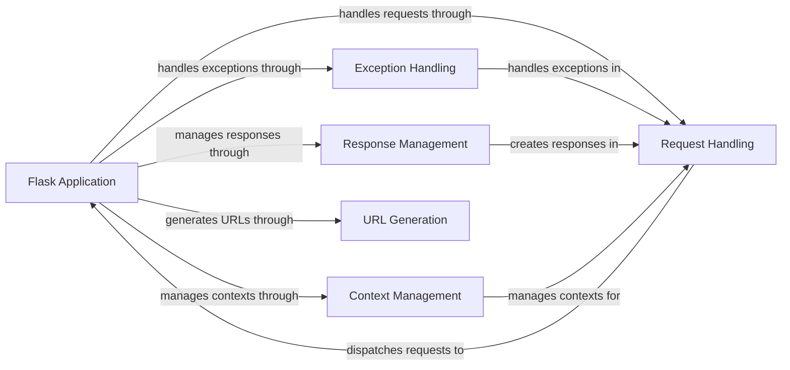

## Component Details

The Flask Application Core manages the lifecycle of a Flask application, handling incoming HTTP requests, routing them to appropriate view functions, managing exceptions, and generating responses. It acts as the central point for request processing and response generation, utilizing contexts to store application and request-specific data. The core orchestrates request handling, exception management, response creation, and URL generation to provide a cohesive application experience.

### Flask Application
The core Flask application instance. It initializes the application, sets up the WSGI environment, and serves as the entry point for handling requests. It also holds the configuration and manages the application lifecycle.
- **Related Classes/Methods**: `flask.src.flask.app.Flask:__init__` (226:279), `flask.src.flask.app.Flask:run` (546:667), `flask.src.flask.app.Flask:wsgi_app` (1479:1527), `flask.src.flask.app.Flask:__call__` (1529:1536)

### Request Handling
This component is responsible for managing the lifecycle of an incoming HTTP request. It preprocesses the request, dispatches it to the appropriate view function based on the URL routing, and then finalizes the response before sending it back to the client.
- **Related Classes/Methods**: `flask.src.flask.app.Flask:preprocess_request` (1271:1296), `flask.src.flask.app.Flask:dispatch_request` (879:902), `flask.src.flask.app.Flask:full_dispatch_request` (904:920), `flask.src.flask.app.Flask:finalize_request` (922:951), `flask.src.flask.app.Flask:process_response` (1298:1324)

### Exception Handling
This component deals with exceptions that occur during request processing. It provides mechanisms to handle HTTP exceptions, user-defined exceptions, and general exceptions, ensuring that errors are gracefully handled and appropriate responses are returned to the client.
- **Related Classes/Methods**: `flask.src.flask.app.Flask:handle_http_exception` (744:777), `flask.src.flask.app.Flask:handle_user_exception` (779:809), `flask.src.flask.app.Flask:handle_exception` (811:862)

### Response Management
This component is responsible for creating and managing HTTP responses. It handles the creation of response objects, including setting headers, content type, and status codes. It also manages default options responses and serving static files.
- **Related Classes/Methods**: `flask.src.flask.app.Flask:make_response` (1129:1269)

### Context Management
This component manages the application and request contexts. It provides a way to store and access application-specific and request-specific data during the request processing lifecycle. This includes managing the teardown of these contexts after the request is complete.
- **Related Classes/Methods**: `flask.src.flask.app.Flask:app_context` (1386:1405), `flask.src.flask.app.Flask:request_context` (1407:1421), `flask.src.flask.app.Flask:test_request_context` (1423:1477), `flask.src.flask.app.Flask:do_teardown_request` (1326:1358), `flask.src.flask.app.Flask:do_teardown_appcontext` (1360:1384)

### URL Generation
This component is responsible for generating URLs for routes based on the endpoint and any provided parameters. It allows developers to dynamically create URLs, ensuring that they are correctly formatted and point to the intended resources.
- **Related Classes/Methods**: `flask.src.flask.app.Flask:url_for` (1003:1127)