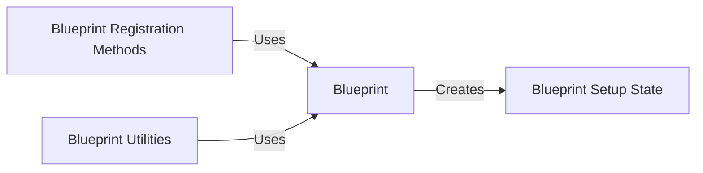

## Component Details

The Blueprint system in Flask allows developers to organize a Flask application into reusable components. A Blueprint encapsulates routes, templates, static files, and other application-related functionality. It provides a way to register these components with a Flask application, enabling modular design and simplifying the management of large applications. The core of the system revolves around the `Blueprint` class, which provides methods for registering various aspects of the blueprint with the application, such as URL rules, template filters, request preprocessors/postprocessors, context processors, and error handlers. The `BlueprintSetupState` manages the state of a blueprint during the setup or registration process, ensuring proper integration with the application. Utility functions support internal workings, such as recording actions and merging blueprint functions.

### Blueprint
The Blueprint class is a central component for organizing a group of related views and other code. It encapsulates routes, templates, static files, and other application-related functionality. It provides methods for registering these components with a Flask application.
- **Related Classes/Methods**: `flask.src.flask.blueprints.Blueprint` (18:128), `flask.src.flask.blueprints.Blueprint.__init__` (19:53), `flask.src.flask.blueprints.Blueprint.send_static_file` (82:102)

### Blueprint Registration Methods
These methods are used to register different aspects of a blueprint with the application, such as URL rules, template filters, request preprocessors/postprocessors, context processors, error handlers, and URL value preprocessors/defaults. They allow developers to define the behavior of the blueprint within the application context.
- **Related Classes/Methods**: `src.flask.sansio.blueprints.Blueprint:register` (273:377), `src.flask.sansio.blueprints.Blueprint:add_url_rule` (413:441), `src.flask.sansio.blueprints.Blueprint:app_template_filter` (444:458), `src.flask.sansio.blueprints.Blueprint:add_app_template_filter` (461:475), `src.flask.sansio.blueprints.Blueprint:before_app_request` (554:561), `src.flask.sansio.blueprints.Blueprint:after_app_request` (564:571), `src.flask.sansio.blueprints.Blueprint:teardown_app_request` (574:581), `src.flask.sansio.blueprints.Blueprint:app_context_processor` (584:593), `src.flask.sansio.blueprints.Blueprint:app_errorhandler` (596:610), `src.flask.sansio.blueprints.Blueprint:app_url_value_preprocessor` (613:622), `src.flask.sansio.blueprints.Blueprint:app_url_defaults` (625:632), `src.flask.sansio.blueprints.Blueprint:app_template_test` (478:494), `src.flask.sansio.blueprints.Blueprint:add_app_template_test` (497:513), `src.flask.sansio.blueprints.Blueprint:app_template_global` (516:532), `src.flask.sansio.blueprints.Blueprint:add_app_template_global` (535:551)

### Blueprint Setup State
The BlueprintSetupState manages the state of a blueprint during the setup or registration process. It stores configuration information, manages resources, and ensures that the blueprint is properly integrated with the application. It is created when a blueprint is registered with an application.
- **Related Classes/Methods**: `src.flask.sansio.blueprints.Blueprint:make_setup_state` (246:253), `src.flask.sansio.blueprints.BlueprintSetupState` (34:116)

### Blueprint Utilities
These functions provide utility features for blueprints, such as recording actions to perform once, merging blueprint functions, and handling static files. They support the internal workings of the Blueprint system.
- **Related Classes/Methods**: `src.flask.sansio.blueprints.Blueprint:record_once` (233:244), `src.flask.sansio.blueprints.Blueprint:_merge_blueprint_funcs` (379:410)