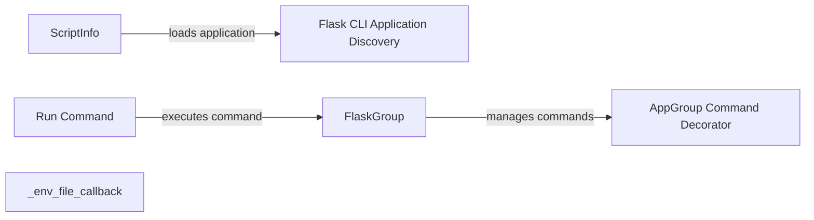

## Component Details

The Flask CLI provides a command-line interface for managing Flask applications. It handles application discovery, command registration, and execution, simplifying deployment and maintenance. The CLI uses Click for command parsing and provides a Flask-specific group to organize commands. It also supports loading environment variables from a file.

### Flask CLI Application Discovery
This component is responsible for locating and loading Flask applications. It searches for the application instance using various strategies, including importing from a module or using a factory function. It ensures that the CLI can find and interact with the correct Flask application.
- **Related Classes/Methods**: `flask.src.flask.cli:find_best_app` (41:91), `flask.src.flask.cli:find_app_by_string` (120:197), `flask.src.flask.cli:locate_app` (230:232)

### ScriptInfo
The ScriptInfo class encapsulates the information needed to load a Flask application. It stores the application factory and provides a method to create the application instance. This allows the CLI to load the application in a consistent manner.
- **Related Classes/Methods**: `flask.src.flask.cli.ScriptInfo:__init__` (305:331), `flask.src.flask.cli.ScriptInfo:load_app` (333:372)

### FlaskGroup
FlaskGroup is a custom Click Group that is used to organize Flask commands. It inherits from Click's Group class and customizes its behavior for Flask applications. It provides methods for listing available commands, getting a specific command, and making the context for command execution.
- **Related Classes/Methods**: `flask.src.flask.cli.FlaskGroup:get_command` (609:634), `flask.src.flask.cli.FlaskGroup:list_commands` (636:655), `flask.src.flask.cli.FlaskGroup:make_context` (657:676)

### AppGroup Command Decorator
The `AppGroup.command` decorator is used to register Click commands with a Flask application. This allows developers to easily add custom commands to their Flask CLI. It simplifies the process of creating and registering commands.
- **Related Classes/Methods**: `flask.src.flask.cli.AppGroup:command` (413:427)

### Run Command
The `run_command` function is responsible for executing a given Click command within the context of a Flask application. It handles setting up the environment and invoking the command's logic. It ensures that the command is executed correctly and provides a consistent execution environment.
- **Related Classes/Methods**: `flask.src.flask.cli:run_command` (935:993)

### _env_file_callback
This function is a callback that is triggered when the `--env-file` option is used. It loads environment variables from the specified file, allowing users to configure their application using environment variables.
- **Related Classes/Methods**: `flask.src.flask.cli:_env_file_callback` (493:512)