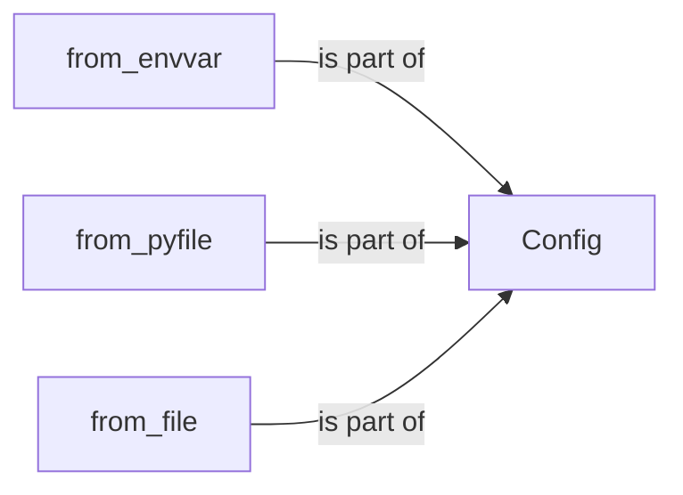

## Component Details

The Flask configuration system provides a way to manage application settings. The core component is the `Config` class, which stores configuration values and provides methods for loading them from various sources like environment variables, Python files, and other files. The `from_envvar`, `from_pyfile`, and `from_file` methods are used to load configuration data into the `Config` object. This system allows developers to customize application behavior without modifying the code directly.

### Config
The Config class manages the application's configuration. It acts as a central repository for configuration settings, allowing different parts of the application to access them. It provides methods to load configuration values from various sources, such as environment variables and Python files.
- **Related Classes/Methods**: `flask.src.flask.config.Config` (50:367)

### from_envvar
Loads configuration from an environment variable. The environment variable should point to a configuration file. This function is part of the Config class and modifies the Config object.
- **Related Classes/Methods**: `flask.src.flask.config.Config:from_envvar` (102:124)

### from_pyfile
Loads configuration from a Python file. This function is part of the Config class and modifies the Config object.
- **Related Classes/Methods**: `flask.src.flask.config.Config:from_pyfile` (187:216)

### from_file
Loads configuration from a file. This function is part of the Config class and modifies the Config object.
- **Related Classes/Methods**: `flask.src.flask.config.Config:from_file` (256:302)