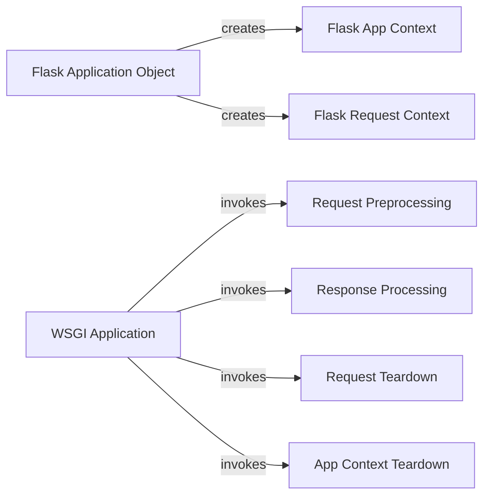

## Component Details

The Context Management component in Flask is responsible for managing the application and request contexts. It ensures that the necessary data and resources are available during request processing and handles cleanup after the request is complete. This enables thread-safe request handling and provides a consistent environment for executing view functions and other request-related logic. The Flask application object creates and manages these contexts, while request preprocessing, response processing, and teardown functions operate within these contexts.

### Flask App Context
The app context manages application-level data during a request. It provides access to resources like the application object (current_app) and configuration. It's entered and exited using a 'with' statement, ensuring proper setup and teardown. This context is essential for accessing application-specific configurations and resources within a request.
- **Related Classes/Methods**: `flask.src.flask.ctx.AppContext:__enter__` (274:276), `flask.src.flask.ctx.AppContext:__exit__` (278:284)

### Flask Request Context
The request context manages request-level data during a request. It provides access to request-specific information like the request object (request), session, and g object. It's entered and exited using a 'with' statement, ensuring proper setup and teardown. It also handles copying the context, which is useful for asynchronous tasks or background processing. This context is crucial for accessing request-specific data and managing the request lifecycle.
- **Related Classes/Methods**: `flask.src.flask.ctx.RequestContext:copy` (337:355), `flask.src.flask.ctx.RequestContext:push` (367:394), `flask.src.flask.ctx.RequestContext:__enter__` (433:435), `flask.src.flask.ctx.RequestContext:__exit__` (437:443)

### Flask Application Object
The Flask application object is the central object of a Flask application. It contains all the application's configuration, URL rules, view functions, and other components. It provides methods for creating application and request contexts, which are essential for managing the application and request lifecycles. The application object is the entry point for configuring and running a Flask application.
- **Related Classes/Methods**: `flask.src.flask.app.Flask:app_context` (1386:1405), `flask.src.flask.app.Flask:request_context` (1407:1421), `flask.src.flask.app.Flask:test_request_context` (1423:1477)

### Request Preprocessing
The request preprocessing stage allows running functions before each request. These functions can modify the request object or perform other setup tasks, such as authentication or authorization. They operate within the request context and can access request-specific data. Preprocessing functions are executed before the view function is called, allowing for early modification or validation of the request.
- **Related Classes/Methods**: `flask.src.flask.app.Flask:preprocess_request` (1271:1296)

### Response Processing
The response processing stage allows running functions after each request. These functions can modify the response object or perform other cleanup tasks, such as adding headers or logging. They operate within the request context and can access request-specific data. Response processing functions are executed after the view function returns, allowing for modification or enhancement of the response.
- **Related Classes/Methods**: `flask.src.flask.app.Flask:process_response` (1298:1324)

### Request Teardown
The request teardown stage allows running functions after each request, even if an exception occurred. These functions are typically used for cleanup tasks like closing database connections or releasing resources. They operate within the request context and are guaranteed to be executed regardless of the request outcome. Teardown functions ensure that resources are properly released and that the application remains in a consistent state.
- **Related Classes/Methods**: `flask.src.flask.app.Flask:do_teardown_request` (1326:1358)

### App Context Teardown
The app context teardown stage allows running functions after the app context is popped, even if an exception occurred. These functions are typically used for cleanup tasks related to the application context, such as releasing application-level resources or performing final cleanup. They operate within the app context and are guaranteed to be executed regardless of the request outcome. Teardown functions ensure that application-level resources are properly released and that the application remains in a consistent state.
- **Related Classes/Methods**: `flask.src.flask.app.Flask:do_teardown_appcontext` (1360:1384)

### WSGI Application
The WSGI application is the entry point for handling requests. It receives a WSGI environment and a start_response callable, and returns a WSGI response. It orchestrates the request preprocessing, view function execution, response processing, and teardown stages, ensuring that the request is handled correctly and efficiently. The WSGI application is the core of the Flask application and is responsible for handling all incoming requests.
- **Related Classes/Methods**: `flask.src.flask.app.Flask:wsgi_app` (1479:1527)