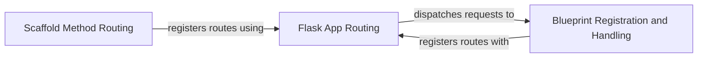

## Component Details

The routing subsystem in Flask is responsible for mapping URLs to specific view functions, enabling the application to handle different requests appropriately. It involves defining URL patterns, associating them with corresponding handlers, and dispatching requests to these handlers based on the requested URL. This system supports various HTTP methods and allows for flexible URL structures, including the use of blueprints for organizing routes.

### Flask App Routing
This component is the core of Flask's routing mechanism. It manages the mapping of incoming requests to the appropriate view functions. It handles request pre-processing, context management, and exception handling during the routing process. The `dispatch_request` method is central to this component, as it determines which view function to call based on the URL and request method.
- **Related Classes/Methods**: `flask.src.app.Flask:dispatch_request` (full file reference), `flask.src.app.Flask:preprocess_request` (full file reference), `flask.src.app.Flask:request_context` (full file reference), `flask.src.app.Flask:raise_routing_exception` (full file reference), `flask.src.app.Flask:url_for` (full file reference)

### Blueprint Registration and Handling
Blueprints provide a modular way to organize Flask applications. This component handles the registration of blueprints, which involves associating URL rules, preprocessors, and default values with the blueprint. The `register` method is used to register a blueprint with the Flask application, and methods like `add_url_rule` allow defining routes within the blueprint.
- **Related Classes/Methods**: `src.flask.sansio.blueprints.Blueprint:register` (273:377), `src.flask.sansio.blueprints.Blueprint:add_url_rule` (413:441), `src.flask.sansio.blueprints.Blueprint:app_url_value_preprocessor` (613:622), `src.flask.sansio.blueprints.Blueprint:app_url_defaults` (625:632)

### Scaffold Method Routing
This component simplifies route definition for different HTTP methods using decorators. It provides methods like `get`, `post`, `put`, `delete`, and `patch` that internally use the `route` method to register routes with the Flask application. The `_method_route` function is a helper that associates a view function with a specific HTTP method.
- **Related Classes/Methods**: `src.flask.sansio.scaffold.Scaffold:_method_route` (284:293), `src.flask.sansio.scaffold.Scaffold:get` (296:301), `src.flask.sansio.scaffold.Scaffold:post` (304:309), `src.flask.sansio.scaffold.Scaffold:put` (312:317), `src.flask.sansio.scaffold.Scaffold:delete` (320:325), `src.flask.sansio.scaffold.Scaffold:patch` (328:333), `src.flask.sansio.scaffold.Scaffold:route` (336:365)