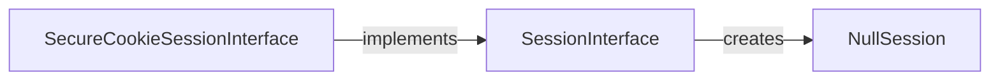

## Component Details

The Sessions component in Flask manages user sessions, allowing applications to store and retrieve user-specific data across multiple requests. It relies on the `SessionInterface` to define the session management behavior, with `SecureCookieSessionInterface` providing a secure cookie-based implementation. The component handles session creation, storage, retrieval, and security, ensuring that session data is protected from unauthorized access. When session creation fails, a `NullSession` is used.

### SessionInterface
Defines the interface for implementing session management in Flask. It provides methods for creating, opening, and saving sessions. Custom session storage mechanisms can be implemented by subclassing this interface.
- **Related Classes/Methods**: `flask.src.flask.sessions.SessionInterface` (114:284), `flask.src.flask.sessions.SessionInterface:make_null_session` (164:174)

### SecureCookieSessionInterface
Implements session management using secure cookies. It serializes the session data, signs it cryptographically, and stores it in a cookie. This ensures that the session data cannot be tampered with by the client. It extends the SessionInterface.
- **Related Classes/Methods**: `flask.src.flask.sessions.SecureCookieSessionInterface` (298:399), `flask.src.flask.sessions.SecureCookieSessionInterface:open_session` (337:349), `flask.src.flask.sessions.SecureCookieSessionInterface:save_session` (351:399)

### NullSession
Represents a session that does not store any data. It is returned by make_null_session when session creation fails.
- **Related Classes/Methods**: `flask.src.flask.sessions.NullSession` (97:111)