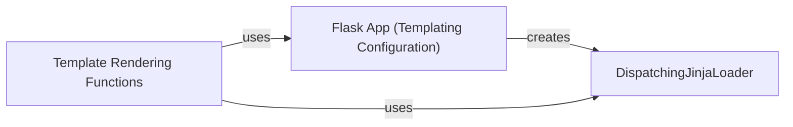

## Component Details

The Templating component in Flask is responsible for rendering dynamic web pages by combining templates with data. It leverages the Jinja2 templating engine to generate HTML responses, separating presentation logic from application code. The process involves configuring the Jinja2 environment, loading templates, providing context data, and rendering the final output, which can be streamed for improved performance.

### Flask App (Templating Configuration)
The Flask application object is responsible for configuring the Jinja2 environment. This includes setting up the template loader, which determines how templates are located and loaded, and defining context processors, which inject variables into the template context. The application also provides a method to update the template context with application-specific variables before rendering.
- **Related Classes/Methods**: `flask.src.flask.app.Flask:create_jinja_environment` (385:423), `flask.src.flask.app.Flask:update_template_context` (506:532)

### DispatchingJinjaLoader
The DispatchingJinjaLoader is a Jinja2 loader that Flask uses to load templates. It extends Jinja2's loader to provide optimized template loading and debugging capabilities. It includes methods to get the source code of a template, with optimizations for speed and explanations for debugging purposes.
- **Related Classes/Methods**: `flask.src.flask.templating.DispatchingJinjaLoader:get_source` (60:65), `flask.src.flask.templating.DispatchingJinjaLoader:_get_source_explained` (67:89), `flask.src.flask.templating.DispatchingJinjaLoader:_get_source_fast` (91:99)

### Template Rendering Functions
These functions provide the core functionality for rendering templates within Flask. They take a template name or string, along with a context (data to be passed to the template), and use the Jinja2 environment to render the template. The rendered output can be returned as a string or streamed for better performance, especially for large templates.
- **Related Classes/Methods**: `flask.src.flask.templating:render_template` (138:150), `flask.src.flask.templating:render_template_string` (153:162), `flask.src.flask.templating:_stream` (165:185), `flask.src.flask.templating:stream_template` (188:204), `flask.src.flask.templating:stream_template_string` (207:219)