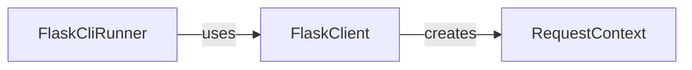

## Component Details

The Flask testing framework provides tools for simulating HTTP requests and executing CLI commands in a test environment. It includes a test client (`FlaskClient`) for making requests to the application and a CLI runner (`FlaskCliRunner`) for invoking commands. These tools facilitate writing unit and integration tests to ensure application correctness and stability by providing a controlled environment for testing application behavior.

### FlaskClient
FlaskClient is a test client for Flask applications. It allows sending requests to the application within a test environment, simulating user interactions and validating responses. It uses the RequestContext to set up the necessary environment for handling a request.
- **Related Classes/Methods**: `flask.src.flask.testing.FlaskClient` (109:262), `flask.src.flask.testing.FlaskClient.__init__` (125:133), `flask.src.flask.testing.FlaskClient._request_from_builder_args` (193:202), `flask.src.flask.testing.FlaskClient:open` (204:247)

### FlaskCliRunner
FlaskCliRunner is a utility to invoke Flask CLI commands in a test environment. It provides a way to execute commands and capture their output for testing purposes. It is built on top of Click's CliRunner.
- **Related Classes/Methods**: `flask.src.flask.testing.FlaskCliRunner` (265:298), `flask.src.flask.testing.FlaskCliRunner:invoke` (275:298)

### RequestContext
RequestContext is a context manager that sets up the necessary environment for handling a request within the Flask application. It manages the application context, request context, and session. It is used by FlaskClient to simulate requests.
- **Related Classes/Methods**: `flask.src.flask.ctx.RequestContext` (287:449)