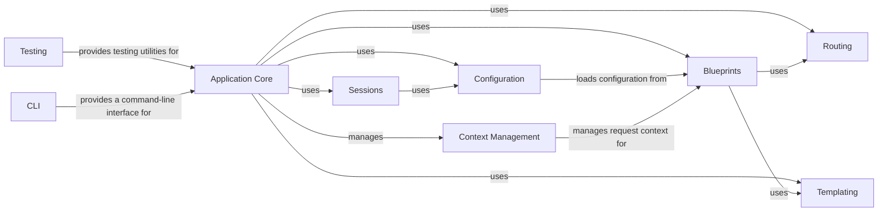

## Component Details

Flask is a micro web framework written in Python. It is designed to be lightweight and flexible, providing the essentials for building web applications while allowing developers to choose the tools and libraries they want to use. The framework includes a built-in development server and debugger, support for secure cookies, and a simple API for building web applications.

### Application Core
The central component responsible for managing the Flask application lifecycle, request handling, and response generation. It initializes the application, processes incoming requests, routes them to the appropriate view functions, and manages the overall flow of the application.
- **Related Classes/Methods**: `flask.src.flask.app.Flask:__init__` (226:279), `flask.src.flask.app.Flask:run` (546:667), `flask.src.flask.app.Flask:handle_http_exception` (744:777), `flask.src.flask.app.Flask:handle_user_exception` (779:809), `flask.src.flask.app.Flask:handle_exception` (811:862), `flask.src.flask.app.Flask:dispatch_request` (879:902), `flask.src.flask.app.Flask:full_dispatch_request` (904:920), `flask.src.flask.app.Flask:finalize_request` (922:951), `flask.src.flask.app.Flask:make_response` (1129:1269), `flask.src.flask.app.Flask:preprocess_request` (1271:1296), `flask.src.flask.app.Flask:process_response` (1298:1324), `flask.src.flask.app.Flask:wsgi_app` (1479:1527), `flask.src.flask.app.Flask:__call__` (1529:1536)

### Context Management
Manages the application and request contexts, providing access to request-specific data and application-level resources. It ensures that the necessary context is available during request processing and handles cleanup after the request is complete, enabling thread-safe request handling.
- **Related Classes/Methods**: `flask.src.flask.ctx.AppContext:__enter__` (274:276), `flask.src.flask.ctx.AppContext:__exit__` (278:284), `flask.src.flask.ctx.RequestContext:copy` (337:355), `flask.src.flask.ctx.RequestContext:push` (367:394), `flask.src.flask.ctx.RequestContext:__enter__` (433:435), `flask.src.flask.ctx.RequestContext:__exit__` (437:443), `flask.src.flask.app.Flask:app_context` (1386:1405), `flask.src.flask.app.Flask:request_context` (1407:1421), `flask.src.flask.app.Flask:test_request_context` (1423:1477)

### Routing
Maps URLs to view functions and dispatches requests to the appropriate handlers. It defines the application's URL structure and determines how requests are processed, supporting various HTTP methods and URL patterns.
- **Related Classes/Methods**: `src.flask.sansio.scaffold.Scaffold:_method_route` (284:293), `src.flask.sansio.scaffold.Scaffold:get` (296:301), `src.flask.sansio.scaffold.Scaffold:post` (304:309), `src.flask.sansio.scaffold.Scaffold:put` (312:317), `src.flask.sansio.scaffold.Scaffold:delete` (320:325), `src.flask.sansio.scaffold.Scaffold:patch` (328:333), `src.flask.sansio.scaffold.Scaffold:route` (336:365), `flask.src.app.Flask:url_for` (full file reference)

### Blueprints
Organizes Flask applications into reusable components, encapsulating routes, templates, and static files. It enables modular design and simplifies the management of large applications by allowing developers to register routes and other application components within a blueprint.
- **Related Classes/Methods**: `flask.src.flask.blueprints.Blueprint:__init__` (19:53), `flask.src.flask.blueprints.Blueprint:send_static_file` (82:102), `src.flask.sansio.blueprints.Blueprint:register` (273:377), `src.flask.sansio.blueprints.Blueprint:add_url_rule` (413:441), `src.flask.sansio.blueprints.Blueprint:app_template_filter` (444:458), `src.flask.sansio.blueprints.Blueprint:add_app_template_filter` (461:475), `src.flask.sansio.blueprints.Blueprint:before_app_request` (554:561), `src.flask.sansio.blueprints.Blueprint:after_app_request` (564:571), `src.flask.sansio.blueprints.Blueprint:teardown_app_request` (574:581), `src.flask.sansio.blueprints.Blueprint:app_context_processor` (584:593), `src.flask.sansio.blueprints.Blueprint:app_errorhandler` (596:610), `src.flask.sansio.blueprints.Blueprint:app_url_value_preprocessor` (613:622), `src.flask.sansio.blueprints.Blueprint:app_url_defaults` (625:632)

### Templating
Renders templates using Jinja2, populating them with data and generating HTML responses. It separates presentation logic from application code, enabling dynamic content generation and supporting features like template inheritance and filters.
- **Related Classes/Methods**: `flask.src.flask.templating.DispatchingJinjaLoader:get_source` (60:65), `flask.src.flask.templating.DispatchingJinjaLoader:_get_source_explained` (67:89), `flask.src.flask.templating.DispatchingJinjaLoader:_get_source_fast` (91:99), `flask.src.flask.templating:render_template` (138:150), `flask.src.flask.templating:render_template_string` (153:162), `flask.src.flask.templating:_stream` (165:185), `flask.src.flask.templating:stream_template` (188:204), `flask.src.flask.templating:stream_template_string` (207:219), `flask.src.flask.app.Flask:create_jinja_environment` (385:423), `flask.src.flask.app.Flask:update_template_context` (506:532)

### Sessions
Manages user sessions using secure cookies, allowing applications to store and retrieve user-specific data across multiple requests. It handles session creation, storage, retrieval, and security, ensuring that session data is protected from unauthorized access.
- **Related Classes/Methods**: `flask.src.flask.sessions.SessionInterface:make_null_session` (164:174), `flask.src.flask.sessions.SecureCookieSessionInterface:open_session` (337:349), `flask.src.flask.sessions.SecureCookieSessionInterface:save_session` (351:399)

### Configuration
Manages application settings loaded from environment variables, files, or other sources. It provides a centralized way to access configuration values throughout the application, supporting different configuration formats and allowing developers to customize application behavior.
- **Related Classes/Methods**: `flask.src.flask.config.Config:from_envvar` (102:124), `flask.src.flask.config.Config:from_pyfile` (187:216), `flask.src.flask.config.Config:from_file` (256:302)

### Testing
Provides tools for testing Flask applications, including a test client for simulating HTTP requests and a CLI runner for executing commands in a test environment. It facilitates writing unit and integration tests to ensure application correctness and stability.
- **Related Classes/Methods**: `flask.src.flask.testing.FlaskClient:__init__` (125:133), `flask.src.flask.testing.FlaskClient:_request_from_builder_args` (193:202), `flask.src.flask.testing.FlaskClient:open` (204:247), `flask.src.flask.testing.FlaskCliRunner:invoke` (275:298)

### CLI
Provides a command-line interface for managing Flask applications, including commands for running the development server, executing database migrations, and performing other administrative tasks. It simplifies application deployment and maintenance by providing a consistent interface for common tasks.
- **Related Classes/Methods**: `flask.src.flask.cli:find_best_app` (41:91), `flask.src.flask.cli:find_app_by_string` (120:197), `flask.src.flask.cli:locate_app` (230:232), `flask.src.flask.cli.ScriptInfo:__init__` (305:331), `flask.src.flask.cli.ScriptInfo:load_app` (333:372), `flask.src.flask.cli.AppGroup:command` (413:427), `flask.src.flask.cli:_env_file_callback` (493:512), `flask.src.flask.cli.FlaskGroup:get_command` (609:634), `flask.src.flask.cli.FlaskGroup:list_commands` (636:655), `flask.src.flask.cli.FlaskGroup:make_context` (657:676), `flask.src.flask.cli:run_command` (935:993)