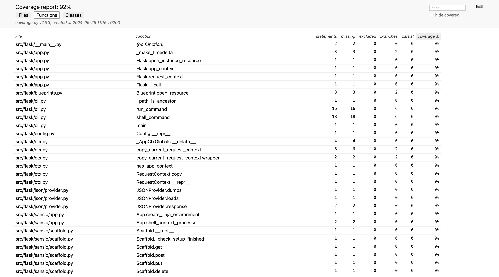
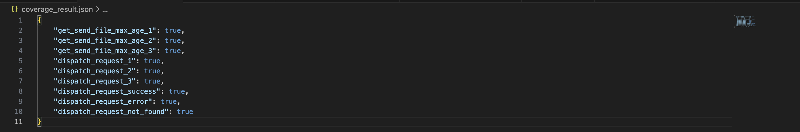
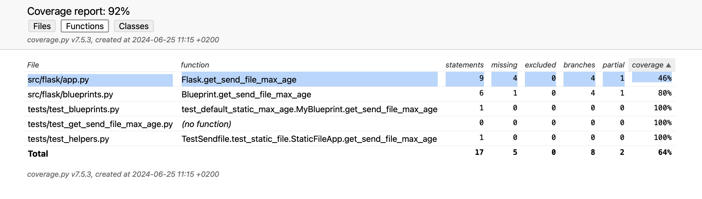
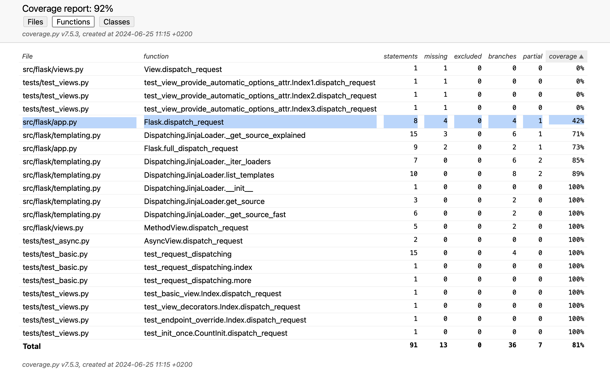
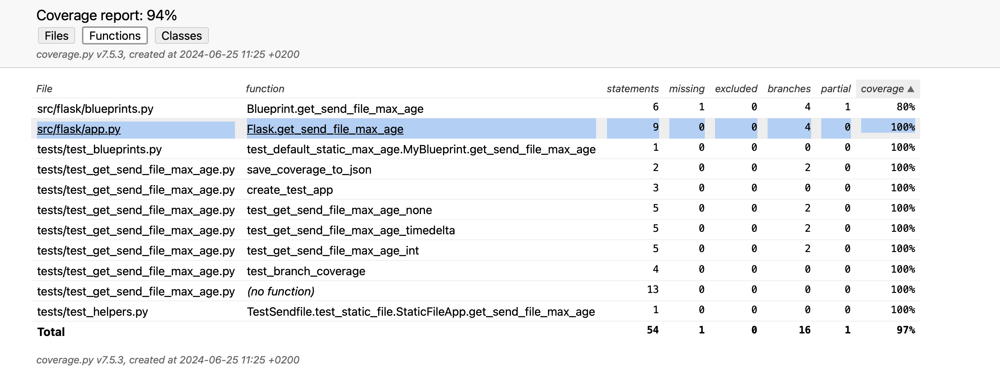
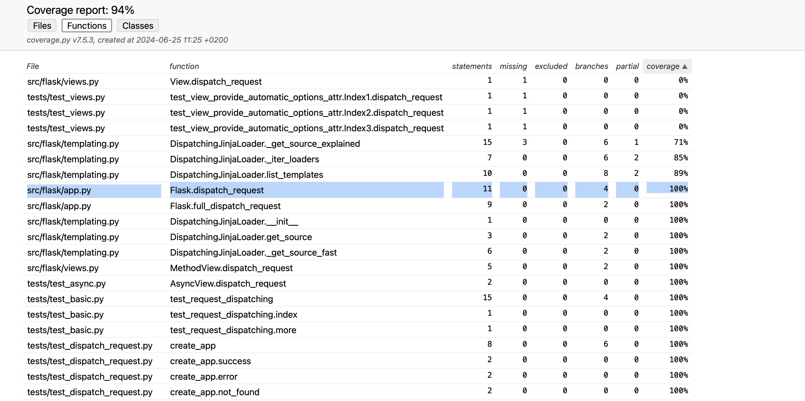
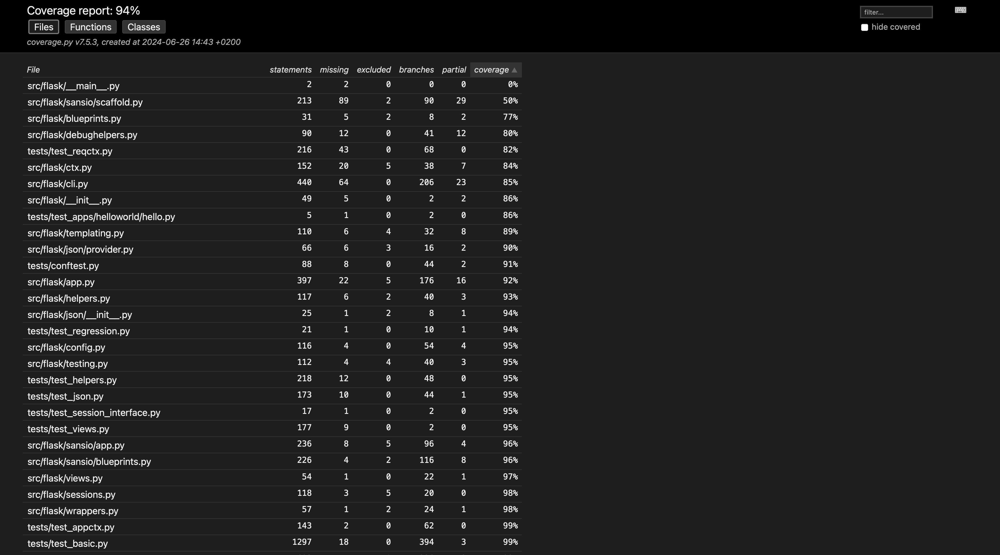

# Report for Assignment 1

## Project chosen

Name: Flask

URL: https://github.com/pallets/flask

Number of lines of code and the tool used to count it: 782430 counted using Lizard

Programming language: Python

## Coverage measurement

### Existing tool

The existing tool used for measuring coverage is coverage.py. It was executed using the following command:

```coverage run -m pytest```



### Your own coverage tool

Group member name: Jannes van den Bogert

Function 1 name: 'get_send_file_max_age'

Commit made: [get_send_file_max_age](https://github.com/pallets/flask/commit/3c984992b97935e17d8f2d42c84128b397cd0e7e)





Function 2 name: dispatch_request

Commit made: [Commit for dispatch_request](https://github.com/pallets/flask/commit/3c984992b97935e17d8f2d42c84128b397cd0e7e)




## Coverage improvement

### Individual tests

Group member name: Jannes van den Bogert

Test 1 name: test_get_send_file_max_age

Commit made: [Commit for test_make_config.py](https://github.com/pallets/flask/compare/main...wasimic311:flask:dev_test_jannes)




The coverage improved by 54%, from 46% to 100%.

Test 2 name: test_dispatch_request

Commit made: [Commit for test_make_config.py](https://github.com/pallets/flask/compare/main...wasimic311:flask:dev_test_jannes)




The coverage improved by 58%, from 42% to 100%.

### Overall




## Statement of individual contributions

Jannes van den Bogert: I was responsible for designing and implementing two tests for the Flask application. The tests targeted two specific functions: get_send_file_max_age and dispatch_request. My contributions were helping in enhancing the test coverage from partial to complete for these functions, achieving a significant increase in overall coverage.
