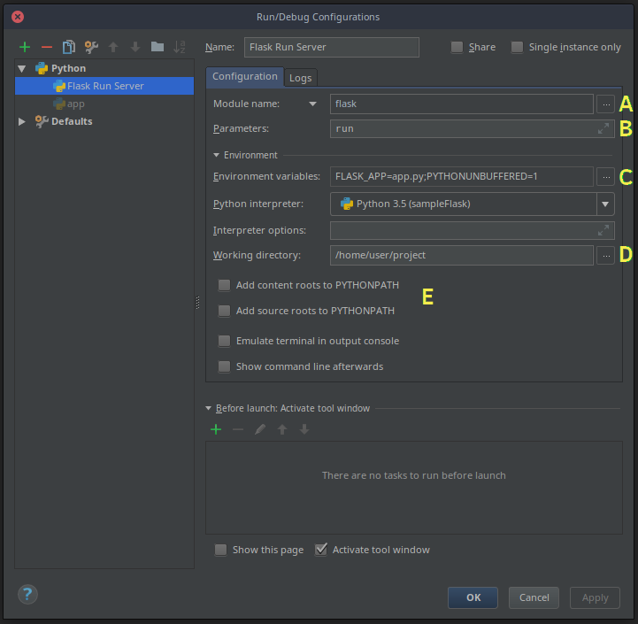

.. currentmodule:: flask

.. _cli:

Command Line Interface
======================

Installing Flask installs the ``flask`` script, a `Click`_ command line
interface, in your virtualenv. Executed from the terminal, this script gives
access to built-in, extension, and application-defined commands. The ``--help``
option will give more information about any commands and options.

.. _Click: https://click.palletsprojects.com/

Application Discovery
---------------------

The ``flask`` command is installed by Flask, not your application; it must be
told where to find your application in order to use it. The ``FLASK_APP``
environment variable is used to specify how to load the application.

Unix Bash (Linux, Mac, etc.)::

    $ export FLASK_APP=hello
    $ flask run

Windows CMD::

    > set FLASK_APP=hello
    > flask run

Windows PowerShell::

    > $env:FLASK_APP = "hello"
    > flask run

While ``FLASK_APP`` supports a variety of options for specifying your
application, most use cases should be simple. Here are the typical values:

(nothing)
    The file :file:`wsgi.py` is imported, automatically detecting an app
    (``app``). This provides an easy way to create an app from a factory with
    extra arguments.

``FLASK_APP=hello``
    The name is imported, automatically detecting an app (``app``) or factory
    (``create_app``).

----

``FLASK_APP`` has three parts: an optional path that sets the current working
directory, a Python file or dotted import path, and an optional variable
name of the instance or factory. If the name is a factory, it can optionally
be followed by arguments in parentheses. The following values demonstrate these
parts:

``FLASK_APP=src/hello``
    Sets the current working directory to ``src`` then imports ``hello``.

``FLASK_APP=hello.web``
    Imports the path ``hello.web``.

``FLASK_APP=hello:app2``
    Uses the ``app2`` Flask instance in ``hello``.

``FLASK_APP="hello:create_app('dev')"``
    The ``create_app`` factory in ``hello`` is called with the string ``'dev'``
    as the argument.

If ``FLASK_APP`` is not set, the command will try to import "app" or
"wsgi" (as a ".py" file, or package) and try to detect an application
instance or factory.

Within the given import, the command looks for an application instance named
``app`` or ``application``, then any application instance. If no instance is
found, the command looks for a factory function named ``create_app`` or
``make_app`` that returns an instance.

When calling an application factory, if the factory takes an argument named
``script_info``, then the :class:`~cli.ScriptInfo` instance is passed as a
keyword argument. If the application factory takes only one argument and no
parentheses follow the factory name, the :class:`~cli.ScriptInfo` instance
is passed as a positional argument. If parentheses follow the factory name,
their contents are parsed as Python literals and passes as arguments to the
function. This means that strings must still be in quotes.

Run the Development Server
--------------------------

The :func:`run <cli.run_command>` command will start the development server. It
replaces the :meth:`Flask.run` method in most cases. ::

    $ flask run
     * Serving Flask app "hello"
     * Running on http://127.0.0.1:5000/ (Press CTRL+C to quit)

.. warning:: Do not use this command to run your application in production.
    Only use the development server during development. The development server
    is provided for convenience, but is not designed to be particularly secure,
    stable, or efficient. See :ref:`deployment` for how to run in production.

Open a Shell
------------

To explore the data in your application, you can start an interactive Python
shell with the :func:`shell <cli.shell_command>` command. An application
context will be active, and the app instance will be imported. ::

    $ flask shell
    Python 3.6.2 (default, Jul 20 2017, 03:52:27)
    [GCC 7.1.1 20170630] on linux
    App: example
    Instance: /home/user/Projects/hello/instance
    >>>

Use :meth:`~Flask.shell_context_processor` to add other automatic imports.

Environments
------------

.. versionadded:: 1.0

The environment in which the Flask app runs is set by the
:envvar:`FLASK_ENV` environment variable. If not set it defaults to
``production``. The other recognized environment is ``development``.
Flask and extensions may choose to enable behaviors based on the
environment.

If the env is set to ``development``, the ``flask`` command will enable
debug mode and ``flask run`` will enable the interactive debugger and
reloader.

::

    $ FLASK_ENV=development flask run
     * Serving Flask app "hello"
     * Environment: development
     * Debug mode: on
     * Running on http://127.0.0.1:5000/ (Press CTRL+C to quit)
     * Restarting with inotify reloader
     * Debugger is active!
     * Debugger PIN: 223-456-919

Watch Extra Files with the Reloader
~~~~~~~~~~~~~~~~~~~~~~~~~~~~~~~~~~~

When using development mode, the reloader will trigger whenever your
Python code or imported modules change. The reloader can watch
additional files with the ``--extra-files`` option, or the
``FLASK_RUN_EXTRA_FILES`` environment variable. Multiple paths are
separated with ``:``, or ``;`` on Windows.

.. code-block:: none

    $ flask run --extra-files file1:dirA/file2:dirB/
    # or
    $ export FLASK_RUN_EXTRA_FILES=file1:dirA/file2:dirB/
    $ flask run
     * Running on http://127.0.0.1:8000/
     * Detected change in '/path/to/file1', reloading

Debug Mode
----------

Debug mode will be enabled when :envvar:`FLASK_ENV` is ``development``,
as described above. If you want to control debug mode separately, use
:envvar:`FLASK_DEBUG`. The value ``1`` enables it, ``0`` disables it.

.. _dotenv:

Environment Variables From dotenv
---------------------------------

Rather than setting ``FLASK_APP`` each time you open a new terminal, you can
use Flask's dotenv support to set environment variables automatically.

If `python-dotenv`_ is installed, running the ``flask`` command will set
environment variables defined in the files :file:`.env` and :file:`.flaskenv`.
This can be used to avoid having to set ``FLASK_APP`` manually every time you
open a new terminal, and to set configuration using environment variables
similar to how some deployment services work.

Variables set on the command line are used over those set in :file:`.env`,
which are used over those set in :file:`.flaskenv`. :file:`.flaskenv` should be
used for public variables, such as ``FLASK_APP``, while :file:`.env` should not
be committed to your repository so that it can set private variables.

Directories are scanned upwards from the directory you call ``flask``
from to locate the files. The current working directory will be set to the
location of the file, with the assumption that that is the top level project
directory.

The files are only loaded by the ``flask`` command or calling
:meth:`~Flask.run`. If you would like to load these files when running in
production, you should call :func:`~cli.load_dotenv` manually.

.. _python-dotenv: https://github.com/theskumar/python-dotenv#readme

Setting Command Options
~~~~~~~~~~~~~~~~~~~~~~~

Click is configured to load default values for command options from
environment variables. The variables use the pattern
``FLASK_COMMAND_OPTION``. For example, to set the port for the run
command, instead of ``flask run --port 8000``:

.. code-block:: bash

    $ export FLASK_RUN_PORT=8000
    $ flask run
     * Running on http://127.0.0.1:8000/

These can be added to the ``.flaskenv`` file just like ``FLASK_APP`` to
control default command options.

Disable dotenv
~~~~~~~~~~~~~~

The ``flask`` command will show a message if it detects dotenv files but
python-dotenv is not installed.

.. code-block:: bash

    $ flask run
     * Tip: There are .env files present. Do "pip install python-dotenv" to use them.

You can tell Flask not to load dotenv files even when python-dotenv is
installed by setting the ``FLASK_SKIP_DOTENV`` environment variable.
This can be useful if you want to load them manually, or if you're using
a project runner that loads them already. Keep in mind that the
environment variables must be set before the app loads or it won't
configure as expected.

.. code-block:: bash

    $ export FLASK_SKIP_DOTENV=1
    $ flask run

Environment Variables From virtualenv
-------------------------------------

If you do not want to install dotenv support, you can still set environment
variables by adding them to the end of the virtualenv's :file:`activate`
script. Activating the virtualenv will set the variables.

Unix Bash, :file:`venv/bin/activate`::

    $ export FLASK_APP=hello

Windows CMD, :file:`venv\\Scripts\\activate.bat`::

    > set FLASK_APP=hello

It is preferred to use dotenv support over this, since :file:`.flaskenv` can be
committed to the repository so that it works automatically wherever the project
is checked out.

Custom Commands
---------------

The ``flask`` command is implemented using `Click`_. See that project's
documentation for full information about writing commands.

This example adds the command ``create-user`` that takes the argument
``name``. ::

    import click
    from flask import Flask

    app = Flask(__name__)

    @app.cli.command("create-user")
    @click.argument("name")
    def create_user(name):
        ...

::

    $ flask create-user admin

This example adds the same command, but as ``user create``, a command in a
group. This is useful if you want to organize multiple related commands. ::

    import click
    from flask import Flask
    from flask.cli import AppGroup

    app = Flask(__name__)
    user_cli = AppGroup('user')

    @user_cli.command('create')
    @click.argument('name')
    def create_user(name):
        ...

    app.cli.add_command(user_cli)

::

    $ flask user create demo

See :ref:`testing-cli` for an overview of how to test your custom
commands.

Registering Commands with Blueprints
~~~~~~~~~~~~~~~~~~~~~~~~~~~~~~~~~~~~

If your application uses blueprints, you can optionally register CLI
commands directly onto them. When your blueprint is registered onto your
application, the associated commands will be available to the ``flask``
command. By default, those commands will be nested in a group matching
the name of the blueprint.

.. code-block:: python

    from flask import Blueprint

    bp = Blueprint('students', __name__)

    @bp.cli.command('create')
    @click.argument('name')
    def create(name):
        ...

    app.register_blueprint(bp)

.. code-block:: text

    $ flask students create alice

You can alter the group name by specifying the ``cli_group`` parameter
when creating the :class:`Blueprint` object, or later with
:meth:`app.register_blueprint(bp, cli_group='...') <Flask.register_blueprint>`.
The following are equivalent:

.. code-block:: python

    bp = Blueprint('students', __name__, cli_group='other')
    # or
    app.register_blueprint(bp, cli_group='other')

.. code-block:: text

    $ flask other create alice

Specifying ``cli_group=None`` will remove the nesting and merge the
commands directly to the application's level:

.. code-block:: python

    bp = Blueprint('students', __name__, cli_group=None)
    # or
    app.register_blueprint(bp, cli_group=None)

.. code-block:: text

    $ flask create alice

Application Context
~~~~~~~~~~~~~~~~~~~

Commands added using the Flask app's :attr:`~Flask.cli`
:meth:`~cli.AppGroup.command` decorator will be executed with an application
context pushed, so your command and extensions have access to the app and its
configuration. If you create a command using the Click :func:`~click.command`
decorator instead of the Flask decorator, you can use
:func:`~cli.with_appcontext` to get the same behavior. ::

    import click
    from flask.cli import with_appcontext

    @click.command()
    @with_appcontext
    def do_work():
        ...

    app.cli.add_command(do_work)

If you're sure a command doesn't need the context, you can disable it::

    @app.cli.command(with_appcontext=False)
    def do_work():
        ...

Plugins
-------

Flask will automatically load commands specified in the ``flask.commands``
`entry point`_. This is useful for extensions that want to add commands when
they are installed. Entry points are specified in :file:`setup.py` ::

    from setuptools import setup

    setup(
        name='flask-my-extension',
        ...,
        entry_points={
            'flask.commands': [
                'my-command=flask_my_extension.commands:cli'
            ],
        },
    )

.. _entry point: https://packaging.python.org/tutorials/packaging-projects/#entry-points

Inside :file:`flask_my_extension/commands.py` you can then export a Click
object::

    import click

    @click.command()
    def cli():
        ...

Once that package is installed in the same virtualenv as your Flask project,
you can run ``flask my-command`` to invoke the command.

.. _custom-scripts:

Custom Scripts
--------------

When you are using the app factory pattern, it may be more convenient to define
your own Click script. Instead of using ``FLASK_APP`` and letting Flask load
your application, you can create your own Click object and export it as a
`console script`_ entry point.

Create an instance of :class:`~cli.FlaskGroup` and pass it the factory::

    import click
    from flask import Flask
    from flask.cli import FlaskGroup

    def create_app():
        app = Flask('wiki')
        # other setup
        return app

    @click.group(cls=FlaskGroup, create_app=create_app)
    def cli():
        """Management script for the Wiki application."""

Define the entry point in :file:`setup.py`::

    from setuptools import setup

    setup(
        name='flask-my-extension',
        ...,
        entry_points={
            'console_scripts': [
                'wiki=wiki:cli'
            ],
        },
    )

Install the application in the virtualenv in editable mode and the custom
script is available. Note that you don't need to set ``FLASK_APP``. ::

    $ pip install -e .
    $ wiki run

.. admonition:: Errors in Custom Scripts

    When using a custom script, if you introduce an error in your
    module-level code, the reloader will fail because it can no longer
    load the entry point.

    The ``flask`` command, being separate from your code, does not have
    this issue and is recommended in most cases.

.. _console script: https://packaging.python.org/tutorials/packaging-projects/#console-scripts

PyCharm Integration
-------------------

PyCharm Professional provides a special Flask run configuration. For
the Community Edition, we need to configure it to call the ``flask run``
CLI command with the correct environment variables. These instructions
should be similar for any other IDE you might want to use.

In PyCharm, with your project open, click on *Run* from the menu bar and
go to *Edit Configurations*. You'll be greeted by a screen similar to
this:

There's quite a few options to change, but once we've done it for one
command, we can easily copy the entire configuration and make a single
tweak to give us access to other commands, including any custom ones you
may implement yourself.

Click the + (*Add New Configuration*) button and select *Python*. Give
the configuration a name such as "flask run". For the ``flask run``
command, check "Single instance only" since you can't run the server
more than once at the same time.

Select *Module name* from the dropdown (**A**) then input ``flask``.

The *Parameters* field (**B**) is set to the CLI command to execute
(with any arguments). In this example we use ``run``, which will run
the development server.

You can skip this next step if you're using :ref:`dotenv`. We need to
add an environment variable (**C**) to identify our application. Click
on the browse button and add an entry with ``FLASK_APP`` on the left and
the Python import or file on the right (``hello`` for example). Add an
entry with ``FLASK_ENV`` and set it to ``development``.

Next we need to set the working directory (**D**) to be the folder where
our application resides.

If you have installed your project as a package in your virtualenv, you
may untick the *PYTHONPATH* options (**E**). This will more accurately
match how you deploy the app later.

Click *Apply* to save the configuration, or *OK* to save and close the
window. Select the configuration in the main PyCharm window and click
the play button next to it to run the server.

Now that we have a configuration which runs ``flask run`` from within
PyCharm, we can copy that configuration and alter the *Script* argument
to run a different CLI command, e.g. ``flask shell``.
