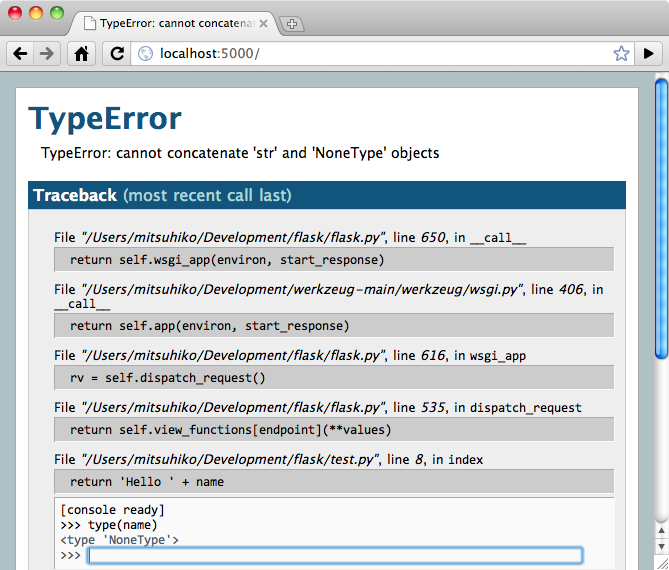

.. _quickstart:

빠르게 시작하기
==========

Flask를 시작하기 원합니까? 이 장은 Flask에 대해 알맞은 소개를 한다. 이 장은 여러분이 이미 Flask를 설치했다고 가정할것이고, 설치가 안됐다면 :ref:`installation` 섹션으로 넘어가기 바란다. 


기본 애플리케이션
---------------------

기본 Flask 어플리케이션은 다음과 같은 모습이다. ::

    from flask import Flask
    app = Flask(__name__)

    @app.route('/')
    def hello_world():
        return 'Hello World!'

    if __name__ == '__main__':
        app.run()

이 내용을 `hello.py` (아니면 비슷한 다른 이름으로) 저장하고 파이썬 인터프리터로 실행한다. 여러분이 작성한 어플리케이션을 `flask.py`로 호출하지 않도록 주의해라. 왜냐하면 Flask 자체와 충돌이 나기 때문이다. 

::

    $ python hello.py
     * Running on http://127.0.0.1:5000/

자, 이제 웹브라우져를 열고 `http://127.0.0.1:5000/ <http://127.0.0.1:5000/>`_, 로 이동해보자 그러면, 여러분이 작성한 hello world greeting이 화면에 나와야한다.

그렇다면, 위의 코드는 무슨 일은 한걸까?

1. 먼저 우리는 :class:`~flask.Flask` class를 임포트했다. 이 클래스의 인스턴스가 우리의
   WSGI어플리케이션이 될것이다. 첫번째 인자는 이 어플리케이션의 이름이다. 여러분이 단일 모듈을 사용한다면(위의 예제처럼),여러분은 `__name__`을 사용해야한다. 왜냐하면, 어플리케이션으로 시작되는지, 혹은 모듈로 임포트되는지에 따라 이름이 달라지기 때문이다.(``'__main__'`` 대 실제로 임포트한 이름) 더 자세한 정보는 :class:`~flask.Flask` 문서를 참고해라.
2. 다음은 Flask class의 인스턴스를 생성한다. 인자로 모듈이나 패키지의 이름을 넣는다.
   이것은 플라스크에서 팀플릿이나 정적파일을 찾을때 필요하다.
3. :meth:`~flask.Flask.route` 데코레이터를 사용해서 Flask에게 어떤 URL이 우리가 
   작성한 함수를 실행시키는지 알려준다.   
4. 작성된 함수의 이름은 그 함수에 대한 URL을 생성하는데 사용되고(url_for 함수 참고), 
   그 함수는 사용자 브라우저에 보여줄 메시지를 리턴한다.
5. 최종적으로 :meth:`~flask.Flask.run` 함수를 사용해서 우리가 개발한 어플리케이션을 
   로컬서버로 실행한다. 소스파일을 모듈이 아닌 python 인터프리터를 이용해서 직접 실행한다면 ``if __name__ == '__main__':`` 이 문장은 우리가 실행한 서버가 현재 동작되는 유일한 서버라는 것을 보장한다.

실행된 서버를 중지하려면, control-C를 누른다.
.. _public-server:

.. admonition:: 외부에서 접근 가능한 서버

   위의 서버를 실행했다면, 그 서버는 네트워크상에 있는 다른 컴퓨터에서 접근이 안되고 
   여러분의 로컬서버에서만 접근 가능하다. 이것이 기본설정인 이유는 디버그모드상에서
   어플리케이션의 사용자가 임의의 파이썬코드를 여러분의 컴퓨터에서 실행할 수 있기 때문이다.

   여러분이 `debug` 모드를 해제하거나 여러분의 네트워크상에 있는 사용자들을 신뢰한다면, 
   다음과 같이 간단히 :meth:`~flask.Flask.run` 메소드의 호출을 변경해서 서버의 접근을 
   오픈할 수 있다. ::

       app.run(host='0.0.0.0')

   위의 변경은 여러분의 OS에게 모든 public IP를 접근가능도록 설정한다. 


.. _debug-mode:


디버그 모드
----------

:meth:`~flask.Flask.run` 메소드는 로컬개발서버를 실행시키기에 좋지만 코드 변경후에
수동으로 재시작해야한다. 플라스크는 그런 번거로운것을 개선한 방식을 제공한다. 여러분이
디버그모드를 지원하면, 서버는 코드변경을 감지하고 자동으로 리로드하고, 문제가 발생하면
문제를 찾을수 있도록 디버거를 제공한다. 


디버깅을 활성화하는 두가지 방식이 있다. 한가지는 어플리케이션 객체에 플래그로 설정하는 방식이거나 ::

    app.debug = True
    app.run()

어플리케이션을 실행할때 파라미터로 넘겨주는 방식이다. ::

    app.run(debug=True)

두 메소드는 같은 결과를 보여준다.

.. admonition:: 주의

   대화식 디버거가 forking 환경에서 동작안됨에도 불구하고(운영서버에서는 거의 사용이 
   불가능함), 여전히 임의의 코드가 실행될 수 있다. 이런점은 주요 보안 취약점이 될 수
   있으므로, **운영 환경에서는 절대 사용하지 말아야한다**.

디버거의 스크린샷:



디버거에 대해 좀 더 궁금하다면  :ref:`working-with-debuggers` 를 참고 하기 바란다.


라우팅
-------

현대 웹 어플리케이션은 잘 구조화된 URL로 구성되있다. 이것으로 사람들은 URL을 쉽게 기억할 
수 있고, 열악한 네트워크 연결 상황하의 기기들에서 동작하는 어플리케이션에서도 사용하기 좋다.
사용자가 인덱스 페이지를 거치지 않고 바로 원하는 페이지로 접근할 수 있다면, 사용자는 그 
페이지를 좋아할 것이고 다시 방문할 가능성이 커진다.


위에서 본것처럼, :meth:`~flask.Flask.route` 데코레이터는 함수와 URL을 연결해준다. 아래는 기본적인 예제들이다. 

    @app.route('/')
    def index():
        return 'Index Page'

    @app.route('/hello')
    def hello():
        return 'Hello World'

하지만, 여기엔 더 많은것이 있다. 여러분은 URL을 동적으로 구성할 수 있고, 함수에 여러 룰을 
덧붙일수있다. 

변수 규칙
``````````````

URL의 변수 부분을 추가하기위해 여러분은 ``<variable_name>``으로 URL에 특별한 영역으로 
표시해야된다. 그 부분은 함수의 키워드 인수로써 넘어간다.  선택적으로,
``<converter:variable_name>`` 으로 규칙을 표시하여 변환기를 추가할 수 있다.  
여기 멋진 예제가 있다. ::

    @app.route('/user/<username>')
    def show_user_profile(username):
        # show the user profile for that user
        return 'User %s' % username

    @app.route('/post/<int:post_id>')
    def show_post(post_id):
        # show the post with the given id, the id is an integer
        return 'Post %d' % post_id

다음과 같은 변환기를 제공한다. :

=========== ===========================================
`int`       accepts integers
`float`     like `int` but for floating point values
`path`      like the default but also accepts slashes
=========== ===========================================

.. admonition:: 유일한 URL과 리디렉션 동작

   Flask의 URL 규칙은 Werkzeug의 라우팅 모듈에 기반한다. 그 라우팅 모듈의 기본 사상은 아파치나 초기 HTTP서버들에서 제공한 전례에 기반을 둔 잘 구성되고 유일한 URL을 보장하는것이다. 

   아래의 두가지 규칙을 살펴보자 ::

        @app.route('/projects/')
        def projects():
            return 'The project page'

        @app.route('/about')
        def about():
            return 'The about page'

   이 두 둘은 비슷해 보이지만, URL 정의에 있어서 뒷 슬래쉬(trailing slash) 사용이 다르다.
   첫번째 경우는, `projects` 끝점에 대한 정규 URL은 뒷 슬래쉬를 포함한다.이점에서 
   파일시스템의 폴더와 유사하다. 뒷 슬래쉬 없이 URL에 접근하면, Flask가 뒷 슬래쉬를 
   가진 정규 URL로 고쳐준다. 
   
   그러나, 두번째 경우의 URL은 Unix계열의 파일의 경로명처럼 뒷 슬래쉬없이 정의됐다. 이 
   경우, 뒷 슬래쉬를 포함해서 URL에 접근하면 404”페이지를 찾지 못함” 에러를 유발한다. 

   이것은 사용자가 뒷 슬래쉬를 잊어버리고 페이지에 접근했을때 상대적인 URL이 문제없이 
   동작하게한다. 이 방식은 아파치 및 다른 서버들이 동작하는 방식과 일치한다. 또한, URL을 
   유일하게 유지할 것이고, 검색엔진이 같은 페이지를 중복해서 색인하지 않도록 도와준다. 


.. _url-building:

URL 생성
````````````

플라스크가 URL을 맞춰줄수 있다면, URL을 생성할 수 있을까? 물론이다. 라우팅이 설정된 함수에 
대한 URL을 얻어내기위해서 여러분은 :func:`~flask.url_for` 함수를 사용하면 된다. 이 
함수는 첫번째 인자로 함수의 이름과 URL 룰의 변수 부분에 대한 다수의 키워드를 인자로 받는다.
알수없는 인자는 쿼리 인자로 URL에 덧붙여진다. :

>>> from flask import Flask, url_for
>>> app = Flask(__name__)
>>> @app.route('/')
... def index(): pass
...
>>> @app.route('/login')
... def login(): pass
...
>>> @app.route('/user/<username>')
... def profile(username): pass
...
>>> with app.test_request_context():
...  print url_for('index')
...  print url_for('login')
...  print url_for('login', next='/')
...  print url_for('profile', username='John Doe')
...
/
/login
/login?next=/
/user/John%20Doe

(이 테스트에서  :meth:`~flask.Flask.test_request_context` 를 사용한다. 이 함수는 
플라스크에게 현재 파이썬 쉘에서 테스트를 하고 있음에도 지금 실제로 요청을 처리하고 있는것 
처럼 상황을 제공한다. :ref:`context-locals` 섹션에서 다시 설명이 언급된다).

왜 템플릿에 URL을 하드코딩하지 않고 URL을 얻어내기를 원하는가? 
여기엔 세가지 적합한 이유가 있다.:

1. URL역변환이 URL을 하드코딩하는것 보다 훨씬 설명적이다. 
   더 중요한것은, 이 방식은 전체적으로 URL이 어디있는지 기억할 필요없이 
   한번에 URL을 다 변경할 수 있다..
2. URL을 얻어내는것은 특수 문자 및 유니코드 데이타를에 대한 이스케이핑을 명확하게 
   해주기때문에 여러분이 그것들을 처리할 필요가 없다..
3. 여러분이 작성한 어플케이션이 URL의 최상위 바깥에 위치한다면 (예를 들면, 
    ``/`` 대신에 ``/myapplication``), :func:`~flask.url_for` 가 그 위치를 상대적 
    위치로 적절하게 처리해줄것이다..


HTTP 메소드
````````````

HTTP(웹 어플리케이션에서 사용하는 프로토콜)는 URL 접근에 대해 몇가지 다른 방식을 제공한다.
기본적으로 `GET` 방식으로 제공되지만, :meth:`~flask.Flask.route` 데코레이터에 
`methods` 인자를 제공하면 다른  방식으로 변경할 수 있다. 아래에 몇가지 예가 있다::

    @app.route('/login', methods=['GET', 'POST'])
    def login():
        if request.method == 'POST':
            do_the_login()
        else:
            show_the_login_form()


`GET` 방식이 나타난다면, `HEAD` 가 자동적으로 더해질것이다. 여러분들이 그것을 처리할 
필요가 없다. `HEAD` 요청은 `HTTP RFC`_ (HTTP프로토콜을 설명하는 문서)의 요청으로써 
처리된다는 것을 보장할 것이다. 그래서 여러분은 HTTP명세에 대한 그 부분을 완전히 신경쓰지 
않아도 된다. 마찬가지로, 플라스크0.6에서는 `OPTION` 을 자동으로 처리한다. 

HTTP 메소드가 뭔지 모르는가? 걱정하지 말자, 여기 짧게 요약된 HTTP 메소드에 대한 소개와 
그것이 중요한 이유가 있다. :

HTTP 메소드 (종종 "the verb" 라고 불리우는..) 는 클라이언트가 서버에게 요청된 페이지를 
통해서 무엇을 **하도록** 원하는지 말해준다. 다음의 메소드들은 매우 일반적인 것들이다 :


`GET`
    브라우저가 어떤 페이지에 저장된 정보를 단지 얻기 위해 서버에 요청하고 서버는 그 정보를 
    보낸다. 가장 일반적인 메소드다.

`HEAD`
    브라우저가 어떤 페이지에 저장된 내용이 아니라 헤더라 불리는 정보를 요청한다. 어떤 
    어플리케이션이 GET 요청을 받은것 처럼 처리하나, 실제 내용이 전달되지 않는다. 하부에 
    있는 Werkzeug 라이브러리들이 그런 처리를 하기 때문에 플라스크에서는 그런 
    처리는 전혀 할 필요가 없다.

`POST`
    브라우저는 서버에게 새로운 정보를 *전송*하도록 특정 URL에 요청하고 그 정보가 오직 한번 
    저장되는것을 보장하도록 한다. 이것이 보통 HTML폼을 통해서 서버에 데이터 전송하는
    방식이다.  

`PUT`
    `POST` 와 유사하지만 서버가 오래된 값들을 한번 이상 덮어쓰면서 store procedure를 
    여러번 실행할 수 있다. 여러분이 이것이 유용한 이유를 물을수도 있지만, 몇가지 적당한 
    이유가 있다. 전송시 연결을 잃어버리는 경우는 생각해보면, 브라우저와 서버사이에서 정보의 
    단절없이 요청을 다시 안전하게 받을 수도 있다. `POST` 는 단 한번 요청을 제공하기 때문에 
    이런 방식은 불가능하다.

`DELETE`
    주어진 위치에 있는 정보를 제거한다..

`OPTIONS`
    클라이언트에게 요청하는 URL이 어떤 메소드를 지원하는지 알려준다. Flask 0.6부터 이 
    기능은 자동 구현된다..

현재 흥미로운 부분은 HTML4와 XHTML1에서 폼이 서버로 전달하는 메소드는 `GET` 과 `POST` 다. 
그러나 자바스크립와 미래의 HTML표준으로 여러분은 다른 메소드도 사용할 수 있다. 
게다가,HTTP는 최근에 상당히 널리 사용되고 있고, 브라우저가 HTTP를 사용하는 유일한 
클라이언트가 아니다. 예를 들면, 많은 버전관리 시스템이 HTTP를 사용한다.

.. _HTTP RFC: http://www.ietf.org/rfc/rfc2068.txt


정적 파일
------------

동적인 웹 어플리케이션은 정적 파일은 필요로한다. 그것들은 보통 자바스크립트나 CSS파일을 
의미한다. 이상적으로 웹서버는 정적 파일들을 서비스하지만, 개발시에는 플라스크가 그 역할을 
대신해준다. 단지 `static` 이라는 폴더를 여러분이 생성한 패키지 아래에 만들거나 모듈 옆에 
위치시키면 개발된 어플리케이션에서 `/static`  위치에서 정적 파일을 제공할 것이다. 

정적파일에 대한 URL을 얻으려면, 특별한 ``'static'`` 끝점 이름을 사용해야한다 :: 

    url_for('static', filename='style.css')


이 파일(style.css)는 파일시스템에 ``static/style.css`` 로 저장되어야한다. 


템플릿 보여주기
-------------------

파이썬 소스코드에서 HTML을 생성하는 것은 그다지 재밌는 일은 아니다.(굉장히 번거로운 일이다) 
왜냐하면 어플리케이션 보안을 위해 동적으로 변환되는 값에 대해 이스케이핑을 여러분 스스로 
작성해야한다. 그런 불편함때문에 Flask는 <http://jinja.pocoo.org/2/>`_ 를 템플릿엔진으로 
구성하여 자동으로 HTML 이스케이핑을 한다.

템플릿을 뿌려주기 위해, 어려분은 :func:`~flask.render_template` 메소드를 사용할 수 있다.
여러분이 해야하는 것은 단지 템플릿의 이름과 템플릿에 보여줄 변수를 키워드 인자로 넘겨주면 
된다. 아래는 템플릿을 뿌려주는 방식의 간단한 예를 보여준다 ::


    from flask import render_template

    @app.route('/hello/')
    @app.route('/hello/<name>')
    def hello(name=None):
        return render_template('hello.html', name=name)


Flask는 `templates` 폴더에서 템플릿을 찾는다. 여러분이 모듈로 어플리케이션을 개발했다면 
이 폴더는 그 모듈 옆에 위치하고, 패키지로 개발했다면 그 패키지 안에 위치한다 :

**Case 1**: 모듈::

    /application.py
    /templates
        /hello.html

**Case 2**: 패키지::

    /application
        /__init__.py
        /templates
            /hello.html

플라스크에서는 템플릿에 있어서 Jinja2의 강력함을 사용할 수 있다. Jinja2에 대한 더 자세한 
내용은 `Jinja2 Template Documentation
<http://jinja.pocoo.org/2/documentation/templates>`_ 공식 문서를 참고하기 바란다. 

여기 템플릿 예제가있다:

.. sourcecode:: html+jinja

    <!doctype html>
    <title>Hello from Flask</title>
    
      <h1>Hello {{ name }}!</h1>
    
      <h1>Hello World!</h1>
    

템플릿 안에서도 여러분은 :class:`~flask.request`,:class:`~flask.session` 와 
:class:`~flask.g` [#]_ 객체에 접근할 수 있다. 

템플릿에서 특히 상속이 유용하게 사용된다. 템플릿 상속에 대해서 자세한 내용을 보고 싶으면 
:ref:`template-inheritance` 패턴문서를 참고하기 바란다. 기본적으로 템플릿 상속은 각 
페이지에서 특정 요소를 유지할수 있게 해준다.(헤더, 네비게이션과 풋터) 

자동 이스케이핑은 켜져있고, `name` 이란 변수가 HTML에 포함되있다면, 그 변수값은 자동으로 
이스케이핑된다. 여러분이 변수가 안전하고 그 변수를 안전한 HTML로 만든다면, 
:class:`~jinja2.Markup` 템플릿에서 ``|safe`` 필터를 사용해서 안전하게 만들수 있다. 
템플릿에 대한 자세한 내용은 Jinja2 문서를 참고하기 바란다.

여기에 :class:`~jinja2.Markup` 클래스를 사용하는 예제가 있다:


>>> from flask import Markup
>>> Markup('<strong>Hello %s!</strong>') % '<blink>hacker</blink>'
Markup(u'<strong>Hello &lt;blink&gt;hacker&lt;/blink&gt;!</strong>')
>>> Markup.escape('<blink>hacker</blink>')
Markup(u'&lt;blink&gt;hacker&lt;/blink&gt;')
>>> Markup('<em>Marked up</em> &raquo; HTML').striptags()
u'Marked up \xbb HTML'

.. versionchanged:: 0.5

   Autoescaping is no longer enabled for all templates.  The following
   extensions for templates trigger autoescaping: ``.html``, ``.htm``,
   ``.xml``, ``.xhtml``.  Templates loaded from a string will have
   autoescaping disabled.

.. [#] Unsure what that :class:`~flask.g` object is? It's something in which
   you can store information for your own needs, check the documentation of
   that object (:class:`~flask.g`) and the :ref:`sqlite3` for more
   information.


요청 데이타 접근하기
----------------------

웹 어플리케이션에 있어서 클라이언트에서 서버로 보내는 데이타를 처리하는 것은 중요한 일이다. 
Flask에서 이 정보는 글로벌한 :class:`~flask.request` 객체에 의해 제공된다. 여러분이 
파이썬 경험이 있다면, 어떻게 그 객체가 글로벌하고 쓰레드 안전하게 처리되는지 궁금할 수 도 
있다. 그 답은 컨텍스트 로컬에 있다. :

.. _context-locals:


컨텍스트 로컬
``````````````

.. 충고:: 내부 정보

   컨텍스트 로컬이 어떻게 동작하고 그것을 가지고 어떻게 테스트를 구현할 수 있는지 이해하고 
   싶다면, 이 장을 읽고, 그렇지 않다면, 다른장으로 넘어가시길..

Flask 에서 어떤 객체들은 보통 객체들이 아닌 전역 객체들이다. 이 객체들은 실제로 어떤 
특정한 문맥에서 지역적인 객체들에 대한 대리자들이다. 무슨 말인지 어렵다. 하지만, 실제로는 꽤 
쉽게 이해할 수 있다. 

쓰레드를 다루는 문맥을 생각해보자. 웹에서 요청이 하나 들어오면, 웹서버는 새로운 쓰레드를 
하나 생성한다 (그렇지 않다면, 다른 방식으로 기반을 이루는 객체가 쓰레드가 아닌 동시성을 
제공하는 시스템을 다룰 수도 있다). 플라스크가 내부적으로 요청을 처리할때, 플라스크는 현재 
처리되는 쓰레드를 활성화된 문맥이라고 간주하고, 현재 실행되는 어플리케이션과 WSGI환경을 그 
문맥(쓰레드)에 연결한다. 이렇게 처리하는 것이 문맥을 지능적으로 처리하는 방식이고, 
이렇게하여 한 어플리케이션이 끊어짐없이 다른 어플리케이션을 호출할 수 있다. 

그렇다면 이것은 여러분에게 어떤 의미인가? 기본적으로 여러분이 유닛 테스트(Unit Test)와 
같은 것을 하지 않는다면 이것을 완전히 무시할 수 있다. 여러분은 요청 객체에 의존하는 코드가 
갑자기 깨지는것을 알게 될것인데, 왜냐하면 요청 객체가 존재하지 않기 때문이다. 해결책은 요청 
객체를 생성해서 그 객체를 문맥에 연결하는 것이다. 유닛 테스트에 있어서 가장 쉬운 해결책은 
:meth:`~flask.Flask.test_request_context` 문맥 관리자(Context Manager)를 사용하는 
것이다. `with` 절과 함께 사용해서 test_request_context() 문맥 관리자는 테스트 요청을 
연결할 것이고, 그렇게해서 여러분은 그 객체와 상호 작용할 수 있다. 아래에 예가 있다::


    from flask import request

    with app.test_request_context('/hello', method='POST'):
        # now you can do something with the request until the
        # end of the with block, such as basic assertions:
        assert request.path == '/hello'
        assert request.method == 'POST'

다른 방법은 WSGI 환경 변수를 :meth:`~flask.Flask.request_context`  메소드에 인자로 
넘기는 것이다. ::


    from flask import request

    with app.request_context(environ):
        assert request.method == 'POST'


요청 객체
``````````````````

요청(requqest) 객체는 API(Application Programming Interface) 장에 설명되있으므로, 
여기서는 자세히 언급하지 않을것이다(see :class:`~flask.request`). 여기서는 가장 일반적인
동작에 대해 거시적으로 살펴본다. 여러분은 먼저 `Flask` 모듈에서 요청 개체를
임포트해야한다:: 


    from flask import request

현재 요청 메소도는 :attr:`~flask.request.method` 속성으로 사용할 수 있다. 폼 데이타(
HTTP `POST` 나 `PUT` 요청으로 전달된 데이타)에 접근하려면, :attr:`~flask.request.form` 
속성을 사용할 수 있다. 아래에 위에서 언급한 두가지 속성에 대한 완전한 예제가 있다:: 

    @app.route('/login', methods=['POST', 'GET'])
    def login():
        error = None
        if request.method == 'POST':
            if valid_login(request.form['username'],
                           request.form['password']):
                return log_the_user_in(request.form['username'])
            else:
                error = 'Invalid username/password'
        # 아래의 코드는 요청이 GET 이거나, 인증정보가 잘못됐을때 실행된다.
        return render_template('login.html', error=error)

위에 `폼` 에 접근한 키(username이나 password)가 존재하지 않으면 어떻게 되나? KeyError가 
발생한다. 여러분은 표준적인 :exc:`KeyError` 로 이 예외를 잡을 수 있지만, 예외처리를 하지 
않는다면 HTTP 400 잘못된 요청(Bad Request)에 대한 오류 페이지를 보여준다. 그렇기 때문에 
대다수의 상황에서 이 문제를 여러분이 직접 처리할 필요는 없다. 

URL로 넘겨진 파라메터 (``?key=value`` 소위 말하는 질의 문자열)에 접근하려면, 여러분은 
:attr:`~flask.request.args` 속성을 사용할 수 있다::

    searchword = request.args.get('key', '')


우리는 args속성의 `get` 을 사용하거나 `KeyError` 예외를 처리하여 URL파라메터에 접근할 
것을 추천한다. 왜냐하면 사용자가 URL을 변경할 수 있으며 사용자에게 친근하지 않은 400 잘못된 
요청 페이지를 보여주기 때문이다.

요청 객체에 대한 메소드와 속성의 전체 목록은 :class:`~flask.request` 문서에서 살펴보라. 


파일 업로드
````````````

 여러분은 Flask를 사용하여 쉽게 업로드된 파일들을 다룰 수 있다. 여러분의 HTMl form에 
 ``enctype="multipart/form-data"`` 가 설정하는 것만 잊지 말아라. 그렇지 않으면 
 브라우저는 파일을 전혀 전송하지 않을 것이다.


업로드된 파일들은 메모리나 파일시스템의 임시 장소에 저장된다. 여러분이 
:attr:`~flask.request.files` 객체의 files 속성을 찾아 그 파일들에 접근할 수 있다. 업로드된 각 파일들은 그 dictionary 안에 저장되어 있다. 그것은 마치 표준 파이썬 :class:`file` 객체처럼 행동한다. 그러나 서버의 파일시스템에 파일을 저장하도록 하는 :meth:`~werkzeug.datastructures.FileStorage.save` 메소드 또한 가지고 있다. 아래 save 메소드가 어떻게 실행되는지를 보여주는 간단한 예제가 있다::


    from flask import request

    @app.route('/upload', methods=['GET', 'POST'])
    def upload_file():
        if request.method == 'POST':
            f = request.files['the_file']
            f.save('/var/www/uploads/uploaded_file.txt')
        ...

만약 여러분의 어플리케이션에 파일이 업로드되기 전 클라이언트에서의 파일명을 알고 싶다면, 
:attr:`~werkzeug.datastructures.FileStorage.filename` 속성에 접근할 수 있다. 그러나 
이 값은 위조될 수 있으며 결코 신뢰할 수 없는 값인 것을 명심해라. 만약 서버에 저장되는 
파일명을 클라이언트에서의 파일명을 그대로 사용하기를 원한다면, Werkzeug에서 제공하는 
:func:`~werkzeug.utils.secure_filename` 함수에 그 파일명을 전달하라::

    from flask import request
    from werkzeug import secure_filename

    @app.route('/upload', methods=['GET', 'POST'])
    def upload_file():
        if request.method == 'POST':
            f = request.files['the_file']
            f.save('/var/www/uploads/' + secure_filename(f.filename))
        ...

더 나은 예제를 보고 싶다면 :ref:`uploading-files` 챕터의 패턴을 확인하라. 


쿠키
```````

쿠키에 접근하기 위해서는 :attr:`~flask.Request.cookies` 속성을 사용할 수 있다. 쿠키를 
저장하기 위해서는 response 객체의 :attr:`~flask.Response.set_cookie` 메소드를 사용할 
수 있다. request 객체의 :attr:`~flask.Request.cookies` 속성은 클라이언트가 전송하는 
모든 쿠키를 가지고 있는 dictionary이다. 만약 여러분이 세션을 
사용하기를 원한다면 쿠키를 직접 사용하는 대신에 쿠키 위에서 보안성을 추가한 Flask의 
:ref:`sessions` 을 사용하라. 


Reading cookies::

    from flask import request

    @app.route('/')
    def index():
        username = request.cookies.get('username')
        # use cookies.get(key) instead of cookies[key] to not get a
        # KeyError if the cookie is missing.

Storing cookies::

    from flask import make_response

    @app.route('/')
    def index():
        resp = make_response(render_template(...))
        resp.set_cookie('username', 'the username')
        return resp


쿠키가 respone 객체에 저장되는 것을 주목하다. 여러분이 보통 뷰 함수로부터 단지 문자열을 
반환하기 때문에, Flask는 그 문자열들을 여러분을 위해 response 객체로 변환할 것이다. 만약 
여러분이 명시적으로 변환하기를 원한다면 여러분은 :meth:`~flask.make_response` 함수를 
사용하여 값을 변경할 수 있다. 

때때로 여러분은 response 객체가 아직 존재하지 않는 시점에 쿠키를 저장하기를 원할 수도 있다.
:ref:`deferred-callbacks` 패턴을 사용하면 가능하다. 

이것을 위해 :ref:`about-responses` 챕터를 참조해라. 


리다이렉션과 에러
--------------------

사용자가 다른 엔드포인트로 redirect하기 위해서는 :func:`~flask.redirect` 함수를 
사용하라. 에러콛를  가지고 일찍 요청을 중단하기를 원한다면 :func:`~flask.abort` 함수를 
사용하라::


    from flask import abort, redirect, url_for

    @app.route('/')
    def index():
        return redirect(url_for('login'))

    @app.route('/login')
    def login():
        abort(401)
        this_is_never_executed()


위 코드는 사용자가 인덱스 페이지에서 그들이 접근할 수 없는(401은 접근불가를 의미) 페이지로 
redirect되어질 것이기 때문에 다소 무의미한 예제일 수는 있으나 어떻게 작동된다는 것을 
보여주고 있다. 


기본으로 하얀 화면에 검정 글씨의 에러 페이지가 각 에러코드를 위해 보여진다. 만약 여러분이 
에러페이지를 변경하기를 원한다면 :meth:`~flask.Flask.errorhandler` 데코레이터를 사용할 
수 있다:: 

    from flask import render_template

    @app.errorhandler(404)
    def page_not_found(error):
        return render_template('page_not_found.html'), 404


:func:`~flask.render_template` 호출 뒤에 있는 ``404`` 를 주목해하. 이것은 페이지의 상태 
코드가 그 페이지를 찾을 수 없다는 404가 되어야 하는 것을 Flask에게 말해 준다. 기본으로 
200이 가정되며, 그것은 모든 것이 잘 실행됐다는 것으로 해석된다. 

.. _about-responses:


응답에 관하여
---------------

view 함수로부터 반환되는 값은 자동으로 response 객체로 변환된다. 만약 반환값이 
문자열이라면 response body로 문자열과 ``200 OK`` 코드, ``text/html`` mimtype을 갖는 
response객체로 변환된다. Flask에서 반환값을 response 객체로 변환하는 로직은 아래와 
같다:


1.  만약 정확한 유형의 response객체가 반환된다면 그 객체는 그대로 뷰로부터 반환되어 진다.
2.  만약 문자열이 반환된다면, response객체는 해당 데이타와 기본 파라미터들을 갖는 
    reponse객체가 생성된다.
3.  만약 튜플이 반환된다면 튜플 안에 있는 아이템들이 추가적인 정보를 제공할 수 있다. 
    그런 퓨틀들은 지정된 폼 ``(response, status, headers)`` 이여야 하며, 그 중 적어도 
    하나의 아이템이 튜플 안에 있어야 한다. `status` 값은 statud code를 오버라이드하면 `
    headers` 는 추가적인 정보의 list, dictionary가 될 수 있다.
4.  만약 위의 것들이 아무것도 적용되지 않는다면, Flask는 반환값이 유효한 WSGI 
    application 이라고 가정하고 WSGI application을 response객체로 변환할 것이다.

만약 여러분이 뷰 안에서 결과 response 객체를 찾기를 원한다면 :func:`~flask.make_response` 함수를 사용할 수 있다. 


아래와 같은 뷰를 가지고 있다고 상상해 보아라:

.. sourcecode:: python

    @app.errorhandler(404)
    def not_found(error):
        return render_template('error.html'), 404


여러분은 단지 :func:`~flask.make_response` 함수를 사용하여 반환되는 표현을 래핑하고, 
변경을 위해 결과 객체를 얻은 다음 반환하기만 하면 된다: 

.. sourcecode:: python

    @app.errorhandler(404)
    def not_found(error):
        resp = make_response(render_template('error.html'), 404)
        resp.headers['X-Something'] = 'A value'
        return resp

.. _sessions:


세션
--------

Request object외에도 하나의 요청에서 다음 요청까지 사용자에 대한 구체적인 정보를 저장할 
수 있는 :class:`~flask.session` 이라는 객체가 있다. 세션은 여러분을 위해 쿠키 위에서 
구현되어 지고 암호화를 사용하여 그 쿠키를 서명한다. 즉, 사용자는 쿠키의 내용을 볼 수는 
있지만 서명을 위해 사용된 비밀키를 알지 못한다면 쿠키의 내용을 변경할 수 없다는 것을 
의미한다.

세션을 사용하기 위해서는 비밀키를 설정해야 한다. 아래 세션이 어떻게 사용되는지 참조해라::


    from flask import Flask, session, redirect, url_for, escape, request

    app = Flask(__name__)

    @app.route('/')
    def index():
        if 'username' in session:
            return 'Logged in as %s' % escape(session['username'])
        return 'You are not logged in'

    @app.route('/login', methods=['GET', 'POST'])
    def login():
        if request.method == 'POST':
            session['username'] = request.form['username']
            return redirect(url_for('index'))
        return '''
            <form action="" method="post">
                <p><input type=text name=username>
                <p><input type=submit value=Login>
            </form>
        '''

    @app.route('/logout')
    def logout():
        # remove the username from the session if it's there
        session.pop('username', None)
        return redirect(url_for('index'))

    # set the secret key.  keep this really secret:
    app.secret_key = 'A0Zr98j/3yX R~XHH!jmN]LWX/,?RT'

위 예제에서 :func:`~flask.escape` 는 템플릿 엔진을 사용하지 않을경우 이스케이프를 한다.


.. 충고:: 좋은 비밀키를 생성하는 방법

무작위(랜덤)로 생성하는 것의 문제는 정말 그것이 무작위(랜덤)한 것인지 판단하기 어렵다는 
것이다. 비밀키는 가능한 한 무작위로 생성되어야 하다. 여러분의 OS는 키를 얻는 데 사용할 수 
있는 cryptographic random generator(암호 난수 발생기) 기반의 꽤 무작위의 키를 생성하는 
방법을 제공한다. :

   >>> import os
   >>> os.urandom(24)
   '\xfd{H\xe5<\x95\xf9\xe3\x96.5\xd1\x01O<!\xd5\xa2\xa0\x9fR"\xa1\xa8'

   위 코드를 여러분의 코드에 복사하기/붙혀넣기만 하면 된다. 

쿠키 기반의 세션: Flask는 여러분이 값들을 세션 객체 안에 넣고 세션 객체들을 쿠키로 직렬화할 
것이다. 만약 쿠키는 사용 가능하나 세션에 저장한 값들이 여러 요청에 걸쳐 지속적으로 사용할 수 
없다는 것을 발견한다면, 그리고 분명한 에러 메세지를 얻지 못한다면, 웹 브라우저에 의해 
지원되는 쿠키 크기와 응답 페이지 내의 쿠키 크기를 확인해라. 


메시지 플래싱
----------------

좋은 어플리케이션과 유저 인터페이스는 모두 피드백에 관한 것이다. 만약 사용자가 충분한 
피드백을 받지 못한다면 사용자들은 아마 결국에는 그 어플리케이션을 싫어할 것이다. Flask는 
flashing system을 사용하여 사용자에게 피드백을 주기 위한 정말 간단한 방법을 제공한다. 
flashing system이란 기본적으로 요청의 끝과 바로 다음 요청에 접근할 때 메세지를 기록하는 
것을 가능하게 한다. 이것은 보통 메세지를 사용자에게 노출하기 위한 레이아웃 템플릿과 
조합되어 있다. 

메세지를 flash 하기 위하여 :func:`~flask.flash` 메소드를 사용하고 메세지를 가져오기 
위하여 템플릿에서 사용할 수 있는 :func:`~flask.get_flashed_messages` 메소드를 사용할 
수 있다. 예제가 필요하면 :ref:`message-flashing-pattern` 챕터를 확인하기 바란다. 


로깅
-------

.. 0.3버전에서 처음 소개되었다:: 0.3


때때로 여러분은 정확해야 하는 데이타를 다뤄야 하나 실제로는 그렇지 못한 상황에 처할 지도 
모른다. 예를 들면 형식이 틀린 HTTP 요청을 서버로 보내는 클라이언트 사이드 코드를 가질 지도 
모른다. 이런 상황은 사용자가 데이타 조작에 의해 발생할 수 있으며, 클라이언트 코드는 
정상적으로 실행되지 않을 것이다. 대부분의 경우에는 이런 상황에서 ``400 Bad Request`` 로 
응답하는 것은 상관없으나 때때로 ``400 Bad Request`` 로 응답하지 않고 코드가 정상적으로 
실행되어야 하는 경우가 있다. 


이런 경우 여러분은 여전히 수상한 어떤 일이 발생한 것을 로깅하기를 원할지도 모른다. 이런 
상황에서 로걸ㄹ 사용할 수 있다. Flask 0.3부터 로거는 여러분이 사용할 수 있도록 미리 
설정되어 있다. 

아래 로그를 출력하는 예제가 있다. ::

    app.logger.debug('A value for debugging')
    app.logger.warning('A warning occurred (%d apples)', 42)
    app.logger.error('An error occurred')

첨부된 :attr:`~flask.Flask.logger`는 표준 로깅 :class:`~logging.Logger` 이다. 더 
많은 정보를 원하면 `logging
documentation <http://docs.python.org/library/logging.html>`_ 문서를 참조해라. 


WSGI 미들웨어에서 후킹하기
---------------------------

만약 여러분이 여러분이 개발한 어플리케이션을 WSGI 미들웨어에 올리기를 원한다면 여러분은 
내부 WSGI 어플리케이션을 래핑할 수 있다. 예를 들면 여러분이 lighttpd의 버그를 피하기 위해 
Werkzeug 패키지의 미들웨어 중 하나를 사용하기를 원한다면, 여러분은 아래 코드와 같이 내부 
WSGI 어플리케이션을 래핑할 수 있다::


    from werkzeug.contrib.fixers import LighttpdCGIRootFix
    app.wsgi_app = LighttpdCGIRootFix(app.wsgi_app)

.. _quickstart_deployment:


웹서버에 배포하기
-------------------------

여러분이 Flask로 개발한 어플리케이션을 배포할 준비가 되었는가? quickstart를 마무리하기 
위하여 여러분은 hosted된 플랫폼에 배포할 수 있다. 모든 플랫폼들은 소규모 프로젝트를 위해 
무료 서비스를 제공한다: 


- `Deploying Flask on Heroku <http://devcenter.heroku.com/articles/python>`_
- `Deploying WSGI on dotCloud <http://docs.dotcloud.com/services/python/>`_
  with `Flask-specific notes <http://flask.pocoo.org/snippets/48/>`_

Flask 어플리케이션을 host할 수 있는 다른 곳도 있다: 

- `Deploying Flask on Webfaction <http://flask.pocoo.org/snippets/65/>`_
- `Deploying Flask on Google App Engine <https://github.com/kamalgill/flask-appengine-template>`_
- `Sharing your Localhost Server with Localtunnel <http://flask.pocoo.org/snippets/89/>`_


만약 여러분이 자신만의 host를 관리하고 서비스하기를 원한다면, :ref:`deployment` 챕터를 
참조하라. 

