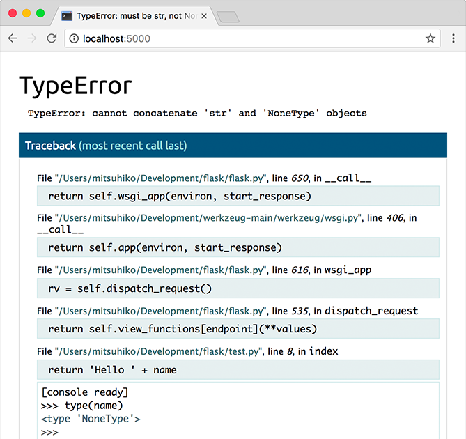

.. _quickstart:

Quickstart
==========

Eager to get started?  This page gives a good introduction to Flask.  It
assumes you already have Flask installed.  If you do not, head over to the
:ref:`installation` section.


A Minimal Application
---------------------

A minimal Flask application looks something like this::

    from flask import Flask
    app = Flask(__name__)

    @app.route('/')
    def hello_world():
        return 'Hello, World!'

So what did that code do?

1. First we imported the :class:`~flask.Flask` class.  An instance of this
   class will be our WSGI application.
2. Next we create an instance of this class. The first argument is the name of
   the application's module or package.  If you are using a single module (as
   in this example), you should use ``__name__`` because depending on if it's
   started as application or imported as module the name will be different
   (``'__main__'`` versus the actual import name). This is needed so that
   Flask knows where to look for templates, static files, and so on. For more
   information have a look at the :class:`~flask.Flask` documentation.
3. We then use the :meth:`~flask.Flask.route` decorator to tell Flask what URL
   should trigger our function.
4. The function is given a name which is also used to generate URLs for that
   particular function, and returns the message we want to display in the
   user's browser.

Just save it as :file:`hello.py` or something similar. Make sure to not call
your application :file:`flask.py` because this would conflict with Flask
itself.

To run the application you can either use the :command:`flask` command or
python's ``-m`` switch with Flask.  Before you can do that you need
to tell your terminal the application to work with by exporting the
``FLASK_APP`` environment variable::

    $ export FLASK_APP=hello.py
    $ flask run
     * Running on http://127.0.0.1:5000/

If you are on Windows you need to use ``set`` instead of ``export``.

Alternatively you can use :command:`python -m flask`::

    $ export FLASK_APP=hello.py
    $ python -m flask run
     * Running on http://127.0.0.1:5000/

This launches a very simple builtin server, which is good enough for testing
but probably not what you want to use in production. For deployment options see
:ref:`deployment`.

Now head over to `http://127.0.0.1:5000/ <http://127.0.0.1:5000/>`_, and you
should see your hello world greeting.

.. _public-server:

.. admonition:: Externally Visible Server

   If you run the server you will notice that the server is only accessible
   from your own computer, not from any other in the network.  This is the
   default because in debugging mode a user of the application can execute
   arbitrary Python code on your computer.

   If you have the debugger disabled or trust the users on your network,
   you can make the server publicly available simply by adding
   ``--host=0.0.0.0`` to the command line::

       flask run --host=0.0.0.0

   This tells your operating system to listen on all public IPs.


What to do if the Server does not Start
---------------------------------------

In case the :command:`python -m flask` fails or :command:`flask` does not exist,
there are multiple reasons this might be the case.  First of all you need
to look at the error message.

Old Version of Flask
````````````````````

Versions of Flask older than 0.11 use to have different ways to start the
application.  In short, the :command:`flask` command did not exist, and
neither did :command:`python -m flask`.  In that case you have two options:
either upgrade to newer Flask versions or have a look at the :ref:`server`
docs to see the alternative method for running a server.

Invalid Import Name
```````````````````

The ``FLASK_APP`` environment variable is the name of the module to import at 
:command:`flask run`. In case that module is incorrectly named you will get an 
import error upon start (or if debug is enabled when you navigate to the 
application). It will tell you what it tried to import and why it failed.

The most common reason is a typo or because you did not actually create an
``app`` object.

.. _debug-mode:

Debug Mode
----------

(Want to just log errors and stack traces? See :ref:`application-errors`)

The :command:`flask` script is nice to start a local development server, but
you would have to restart it manually after each change to your code.
That is not very nice and Flask can do better.  If you enable debug
support the server will reload itself on code changes, and it will also
provide you with a helpful debugger if things go wrong.

To enable debug mode you can export the ``FLASK_DEBUG`` environment variable
before running the server::

    $ export FLASK_DEBUG=1
    $ flask run

(On Windows you need to use ``set`` instead of ``export``).

This does the following things:

1.  it activates the debugger
2.  it activates the automatic reloader
3.  it enables the debug mode on the Flask application.

There are more parameters that are explained in the :ref:`server` docs.

.. admonition:: Attention

   Even though the interactive debugger does not work in forking environments
   (which makes it nearly impossible to use on production servers), it still
   allows the execution of arbitrary code. This makes it a major security risk
   and therefore it **must never be used on production machines**.

Screenshot of the debugger in action:



Have another debugger in mind? See :ref:`working-with-debuggers`.


Routing
-------

Modern web applications have beautiful URLs.  This helps people remember
the URLs, which is especially handy for applications that are used from
mobile devices with slower network connections.  If the user can directly
go to the desired page without having to hit the index page it is more
likely they will like the page and come back next time.

As you have seen above, the :meth:`~flask.Flask.route` decorator is used to
bind a function to a URL.  Here are some basic examples::

    @app.route('/')
    def index():
        return 'Index Page'

    @app.route('/hello')
    def hello():
        return 'Hello, World'

But there is more to it!  You can make certain parts of the URL dynamic and
attach multiple rules to a function.

Variable Rules
``````````````

To add variable parts to a URL you can mark these special sections as
``<variable_name>``.  Such a part is then passed as a keyword argument to your
function.  Optionally a converter can be used by specifying a rule with
``<converter:variable_name>``.  Here are some nice examples::

    @app.route('/user/<username>')
    def show_user_profile(username):
        # show the user profile for that user
        return 'User %s' % username

    @app.route('/post/<int:post_id>')
    def show_post(post_id):
        # show the post with the given id, the id is an integer
        return 'Post %d' % post_id

The following converters exist:

=========== ===============================================
`string`    accepts any text without a slash (the default)
`int`       accepts integers
`float`     like ``int`` but for floating point values
`path`      like the default but also accepts slashes
`any`       matches one of the items provided
`uuid`      accepts UUID strings
=========== ===============================================

.. admonition:: Unique URLs / Redirection Behavior

   Flask's URL rules are based on Werkzeug's routing module.  The idea
   behind that module is to ensure beautiful and unique URLs based on
   precedents laid down by Apache and earlier HTTP servers.

   Take these two rules::

        @app.route('/projects/')
        def projects():
            return 'The project page'

        @app.route('/about')
        def about():
            return 'The about page'

   Though they look rather similar, they differ in their use of the trailing
   slash in the URL *definition*.  In the first case, the canonical URL for the
   ``projects`` endpoint has a trailing slash.  In that sense, it is similar to
   a folder on a filesystem.  Accessing it without a trailing slash will cause
   Flask to redirect to the canonical URL with the trailing slash.

   In the second case, however, the URL is defined without a trailing slash,
   rather like the pathname of a file on UNIX-like systems. Accessing the URL
   with a trailing slash will produce a 404 "Not Found" error.

   This behavior allows relative URLs to continue working even if the trailing
   slash is omitted, consistent with how Apache and other servers work.  Also,
   the URLs will stay unique, which helps search engines avoid indexing the
   same page twice.


.. _url-building:

URL Building
````````````

If it can match URLs, can Flask also generate them?  Of course it can.  To
build a URL to a specific function you can use the :func:`~flask.url_for`
function.  It accepts the name of the function as first argument and a number
of keyword arguments, each corresponding to the variable part of the URL rule.
Unknown variable parts are appended to the URL as query parameters.  Here are
some examples::

    >>> from flask import Flask, url_for
    >>> app = Flask(__name__)
    >>> @app.route('/')
    ... def index(): pass
    ...
    >>> @app.route('/login')
    ... def login(): pass
    ...
    >>> @app.route('/user/<username>')
    ... def profile(username): pass
    ...
    >>> with app.test_request_context():
    ...  print url_for('index')
    ...  print url_for('login')
    ...  print url_for('login', next='/')
    ...  print url_for('profile', username='John Doe')
    ...
    /
    /login
    /login?next=/
    /user/John%20Doe

(This also uses the :meth:`~flask.Flask.test_request_context` method, explained
below.  It tells Flask to behave as though it is handling a request, even
though we are interacting with it through a Python shell.  Have a look at the
explanation below. :ref:`context-locals`).

Why would you want to build URLs using the URL reversing function
:func:`~flask.url_for` instead of hard-coding them into your templates?
There are three good reasons for this:

1. Reversing is often more descriptive than hard-coding the URLs.  More
   importantly, it allows you to change URLs in one go, without having to
   remember to change URLs all over the place.
2. URL building will handle escaping of special characters and Unicode
   data transparently for you, so you don't have to deal with them.
3. If your application is placed outside the URL root - say, in
   ``/myapplication`` instead of ``/`` - :func:`~flask.url_for` will handle
   that properly for you.


HTTP Methods
````````````

HTTP (the protocol web applications are speaking) knows different methods for
accessing URLs.  By default, a route only answers to ``GET`` requests, but that
can be changed by providing the ``methods`` argument to the
:meth:`~flask.Flask.route` decorator.  Here are some examples::

    from flask import request

    @app.route('/login', methods=['GET', 'POST'])
    def login():
        if request.method == 'POST':
            do_the_login()
        else:
            show_the_login_form()

If ``GET`` is present, ``HEAD`` will be added automatically for you.  You
don't have to deal with that.  It will also make sure that ``HEAD`` requests
are handled as the `HTTP RFC`_ (the document describing the HTTP
protocol) demands, so you can completely ignore that part of the HTTP
specification.  Likewise, as of Flask 0.6, ``OPTIONS`` is implemented for you
automatically as well.

You have no idea what an HTTP method is?  Worry not, here is a quick
introduction to HTTP methods and why they matter:

The HTTP method (also often called "the verb") tells the server what the
client wants to *do* with the requested page.  The following methods are
very common:

``GET``
    The browser tells the server to just *get* the information stored on
    that page and send it.  This is probably the most common method.

``HEAD``
    The browser tells the server to get the information, but it is only
    interested in the *headers*, not the content of the page.  An
    application is supposed to handle that as if a ``GET`` request was
    received but to not deliver the actual content.  In Flask you don't
    have to deal with that at all, the underlying Werkzeug library handles
    that for you.

``POST``
    The browser tells the server that it wants to *post* some new
    information to that URL and that the server must ensure the data is
    stored and only stored once.  This is how HTML forms usually
    transmit data to the server.

``PUT``
    Similar to ``POST`` but the server might trigger the store procedure
    multiple times by overwriting the old values more than once.  Now you
    might be asking why this is useful, but there are some good reasons
    to do it this way.  Consider that the connection is lost during
    transmission: in this situation a system between the browser and the
    server might receive the request safely a second time without breaking
    things.  With ``POST`` that would not be possible because it must only
    be triggered once.

``DELETE``
    Remove the information at the given location.

``OPTIONS``
    Provides a quick way for a client to figure out which methods are
    supported by this URL.  Starting with Flask 0.6, this is implemented
    for you automatically.

Now the interesting part is that in HTML4 and XHTML1, the only methods a
form can submit to the server are ``GET`` and ``POST``.  But with JavaScript
and future HTML standards you can use the other methods as well.  Furthermore
HTTP has become quite popular lately and browsers are no longer the only
clients that are using HTTP. For instance, many revision control systems
use it.

.. _HTTP RFC: http://www.ietf.org/rfc/rfc2068.txt

Static Files
------------

Dynamic web applications also need static files.  That's usually where
the CSS and JavaScript files are coming from.  Ideally your web server is
configured to serve them for you, but during development Flask can do that
as well.  Just create a folder called :file:`static` in your package or next to
your module and it will be available at ``/static`` on the application.

To generate URLs for static files, use the special ``'static'`` endpoint name::

    url_for('static', filename='style.css')

The file has to be stored on the filesystem as :file:`static/style.css`.

Rendering Templates
-------------------

Generating HTML from within Python is not fun, and actually pretty
cumbersome because you have to do the HTML escaping on your own to keep
the application secure.  Because of that Flask configures the `Jinja2
<http://jinja.pocoo.org/>`_ template engine for you automatically.

To render a template you can use the :func:`~flask.render_template`
method.  All you have to do is provide the name of the template and the
variables you want to pass to the template engine as keyword arguments.
Here's a simple example of how to render a template::

    from flask import render_template

    @app.route('/hello/')
    @app.route('/hello/<name>')
    def hello(name=None):
        return render_template('hello.html', name=name)

Flask will look for templates in the :file:`templates` folder.  So if your
application is a module, this folder is next to that module, if it's a
package it's actually inside your package:

**Case 1**: a module::

    /application.py
    /templates
        /hello.html

**Case 2**: a package::

    /application
        /__init__.py
        /templates
            /hello.html

For templates you can use the full power of Jinja2 templates.  Head over
to the official `Jinja2 Template Documentation
<http://jinja.pocoo.org/docs/templates>`_ for more information.

Here is an example template:

.. sourcecode:: html+jinja

    <!doctype html>
    <title>Hello from Flask</title>
    
      <h1>Hello {{ name }}!</h1>
    
      <h1>Hello, World!</h1>
    

Inside templates you also have access to the :class:`~flask.request`,
:class:`~flask.session` and :class:`~flask.g` [#]_ objects
as well as the :func:`~flask.get_flashed_messages` function.

Templates are especially useful if inheritance is used.  If you want to
know how that works, head over to the :ref:`template-inheritance` pattern
documentation.  Basically template inheritance makes it possible to keep
certain elements on each page (like header, navigation and footer).

Automatic escaping is enabled, so if ``name`` contains HTML it will be escaped
automatically.  If you can trust a variable and you know that it will be
safe HTML (for example because it came from a module that converts wiki
markup to HTML) you can mark it as safe by using the
:class:`~jinja2.Markup` class or by using the ``|safe`` filter in the
template.  Head over to the Jinja 2 documentation for more examples.

Here is a basic introduction to how the :class:`~jinja2.Markup` class works::

    >>> from flask import Markup
    >>> Markup('<strong>Hello %s!</strong>') % '<blink>hacker</blink>'
    Markup(u'<strong>Hello &lt;blink&gt;hacker&lt;/blink&gt;!</strong>')
    >>> Markup.escape('<blink>hacker</blink>')
    Markup(u'&lt;blink&gt;hacker&lt;/blink&gt;')
    >>> Markup('<em>Marked up</em> &raquo; HTML').striptags()
    u'Marked up \xbb HTML'

.. versionchanged:: 0.5

   Autoescaping is no longer enabled for all templates.  The following
   extensions for templates trigger autoescaping: ``.html``, ``.htm``,
   ``.xml``, ``.xhtml``.  Templates loaded from a string will have
   autoescaping disabled.

.. [#] Unsure what that :class:`~flask.g` object is? It's something in which
   you can store information for your own needs, check the documentation of
   that object (:class:`~flask.g`) and the :ref:`sqlite3` for more
   information.


Accessing Request Data
----------------------

For web applications it's crucial to react to the data a client sends to
the server.  In Flask this information is provided by the global
:class:`~flask.request` object.  If you have some experience with Python
you might be wondering how that object can be global and how Flask
manages to still be threadsafe.  The answer is context locals:


.. _context-locals:

Context Locals
``````````````

.. admonition:: Insider Information

   If you want to understand how that works and how you can implement
   tests with context locals, read this section, otherwise just skip it.

Certain objects in Flask are global objects, but not of the usual kind.
These objects are actually proxies to objects that are local to a specific
context.  What a mouthful.  But that is actually quite easy to understand.

Imagine the context being the handling thread.  A request comes in and the
web server decides to spawn a new thread (or something else, the
underlying object is capable of dealing with concurrency systems other
than threads).  When Flask starts its internal request handling it
figures out that the current thread is the active context and binds the
current application and the WSGI environments to that context (thread).
It does that in an intelligent way so that one application can invoke another
application without breaking.

So what does this mean to you?  Basically you can completely ignore that
this is the case unless you are doing something like unit testing.  You
will notice that code which depends on a request object will suddenly break
because there is no request object.  The solution is creating a request
object yourself and binding it to the context.  The easiest solution for
unit testing is to use the :meth:`~flask.Flask.test_request_context`
context manager.  In combination with the ``with`` statement it will bind a
test request so that you can interact with it.  Here is an example::

    from flask import request

    with app.test_request_context('/hello', method='POST'):
        # now you can do something with the request until the
        # end of the with block, such as basic assertions:
        assert request.path == '/hello'
        assert request.method == 'POST'

The other possibility is passing a whole WSGI environment to the
:meth:`~flask.Flask.request_context` method::

    from flask import request

    with app.request_context(environ):
        assert request.method == 'POST'

The Request Object
``````````````````

The request object is documented in the API section and we will not cover
it here in detail (see :class:`~flask.request`). Here is a broad overview of
some of the most common operations.  First of all you have to import it from
the ``flask`` module::

    from flask import request

The current request method is available by using the
:attr:`~flask.request.method` attribute.  To access form data (data
transmitted in a ``POST`` or ``PUT`` request) you can use the
:attr:`~flask.request.form` attribute.  Here is a full example of the two
attributes mentioned above::

    @app.route('/login', methods=['POST', 'GET'])
    def login():
        error = None
        if request.method == 'POST':
            if valid_login(request.form['username'],
                           request.form['password']):
                return log_the_user_in(request.form['username'])
            else:
                error = 'Invalid username/password'
        # the code below is executed if the request method
        # was GET or the credentials were invalid
        return render_template('login.html', error=error)

What happens if the key does not exist in the ``form`` attribute?  In that
case a special :exc:`KeyError` is raised.  You can catch it like a
standard :exc:`KeyError` but if you don't do that, a HTTP 400 Bad Request
error page is shown instead.  So for many situations you don't have to
deal with that problem.

To access parameters submitted in the URL (``?key=value``) you can use the
:attr:`~flask.request.args` attribute::

    searchword = request.args.get('key', '')

We recommend accessing URL parameters with `get` or by catching the
:exc:`KeyError` because users might change the URL and presenting them a 400
bad request page in that case is not user friendly.

For a full list of methods and attributes of the request object, head over
to the :class:`~flask.request` documentation.


File Uploads
````````````

You can handle uploaded files with Flask easily.  Just make sure not to
forget to set the ``enctype="multipart/form-data"`` attribute on your HTML
form, otherwise the browser will not transmit your files at all.

Uploaded files are stored in memory or at a temporary location on the
filesystem.  You can access those files by looking at the
:attr:`~flask.request.files` attribute on the request object.  Each
uploaded file is stored in that dictionary.  It behaves just like a
standard Python :class:`file` object, but it also has a
:meth:`~werkzeug.datastructures.FileStorage.save` method that allows you to store that
file on the filesystem of the server.  Here is a simple example showing how
that works::

    from flask import request

    @app.route('/upload', methods=['GET', 'POST'])
    def upload_file():
        if request.method == 'POST':
            f = request.files['the_file']
            f.save('/var/www/uploads/uploaded_file.txt')
        ...

If you want to know how the file was named on the client before it was
uploaded to your application, you can access the
:attr:`~werkzeug.datastructures.FileStorage.filename` attribute.  However please keep in
mind that this value can be forged so never ever trust that value.  If you
want to use the filename of the client to store the file on the server,
pass it through the :func:`~werkzeug.utils.secure_filename` function that
Werkzeug provides for you::

    from flask import request
    from werkzeug.utils import secure_filename

    @app.route('/upload', methods=['GET', 'POST'])
    def upload_file():
        if request.method == 'POST':
            f = request.files['the_file']
            f.save('/var/www/uploads/' + secure_filename(f.filename))
        ...

For some better examples, checkout the :ref:`uploading-files` pattern.

Cookies
```````

To access cookies you can use the :attr:`~flask.Request.cookies`
attribute.  To set cookies you can use the
:attr:`~flask.Response.set_cookie` method of response objects.  The
:attr:`~flask.Request.cookies` attribute of request objects is a
dictionary with all the cookies the client transmits.  If you want to use
sessions, do not use the cookies directly but instead use the
:ref:`sessions` in Flask that add some security on top of cookies for you.

Reading cookies::

    from flask import request

    @app.route('/')
    def index():
        username = request.cookies.get('username')
        # use cookies.get(key) instead of cookies[key] to not get a
        # KeyError if the cookie is missing.

Storing cookies::

    from flask import make_response

    @app.route('/')
    def index():
        resp = make_response(render_template(...))
        resp.set_cookie('username', 'the username')
        return resp

Note that cookies are set on response objects.  Since you normally
just return strings from the view functions Flask will convert them into
response objects for you.  If you explicitly want to do that you can use
the :meth:`~flask.make_response` function and then modify it.

Sometimes you might want to set a cookie at a point where the response
object does not exist yet.  This is possible by utilizing the
:ref:`deferred-callbacks` pattern.

For this also see :ref:`about-responses`.

Redirects and Errors
--------------------

To redirect a user to another endpoint, use the :func:`~flask.redirect`
function; to abort a request early with an error code, use the
:func:`~flask.abort` function::

    from flask import abort, redirect, url_for

    @app.route('/')
    def index():
        return redirect(url_for('login'))

    @app.route('/login')
    def login():
        abort(401)
        this_is_never_executed()

This is a rather pointless example because a user will be redirected from
the index to a page they cannot access (401 means access denied) but it
shows how that works.

By default a black and white error page is shown for each error code.  If
you want to customize the error page, you can use the
:meth:`~flask.Flask.errorhandler` decorator::

    from flask import render_template

    @app.errorhandler(404)
    def page_not_found(error):
        return render_template('page_not_found.html'), 404

Note the ``404`` after the :func:`~flask.render_template` call.  This
tells Flask that the status code of that page should be 404 which means
not found.  By default 200 is assumed which translates to: all went well.

See :ref:`error-handlers` for more details.

.. _about-responses:

About Responses
---------------

The return value from a view function is automatically converted into a
response object for you.  If the return value is a string it's converted
into a response object with the string as response body, a ``200 OK``
status code and a :mimetype:`text/html` mimetype.  The logic that Flask applies to
converting return values into response objects is as follows:

1.  If a response object of the correct type is returned it's directly
    returned from the view.
2.  If it's a string, a response object is created with that data and the
    default parameters.
3.  If a tuple is returned the items in the tuple can provide extra
    information.  Such tuples have to be in the form ``(response, status,
    headers)`` or ``(response, headers)`` where at least one item has
    to be in the tuple.  The ``status`` value will override the status code
    and ``headers`` can be a list or dictionary of additional header values.
4.  If none of that works, Flask will assume the return value is a
    valid WSGI application and convert that into a response object.

If you want to get hold of the resulting response object inside the view
you can use the :func:`~flask.make_response` function.

Imagine you have a view like this::

    @app.errorhandler(404)
    def not_found(error):
        return render_template('error.html'), 404

You just need to wrap the return expression with
:func:`~flask.make_response` and get the response object to modify it, then
return it::

    @app.errorhandler(404)
    def not_found(error):
        resp = make_response(render_template('error.html'), 404)
        resp.headers['X-Something'] = 'A value'
        return resp

.. _sessions:

Sessions
--------

In addition to the request object there is also a second object called
:class:`~flask.session` which allows you to store information specific to a
user from one request to the next.  This is implemented on top of cookies
for you and signs the cookies cryptographically.  What this means is that
the user could look at the contents of your cookie but not modify it,
unless they know the secret key used for signing.

In order to use sessions you have to set a secret key.  Here is how
sessions work::

    from flask import Flask, session, redirect, url_for, escape, request

    app = Flask(__name__)

    @app.route('/')
    def index():
        if 'username' in session:
            return 'Logged in as %s' % escape(session['username'])
        return 'You are not logged in'

    @app.route('/login', methods=['GET', 'POST'])
    def login():
        if request.method == 'POST':
            session['username'] = request.form['username']
            return redirect(url_for('index'))
        return '''
            <form method="post">
                <p><input type=text name=username>
                <p><input type=submit value=Login>
            </form>
        '''

    @app.route('/logout')
    def logout():
        # remove the username from the session if it's there
        session.pop('username', None)
        return redirect(url_for('index'))

    # set the secret key.  keep this really secret:
    app.secret_key = 'A0Zr98j/3yX R~XHH!jmN]LWX/,?RT'

The :func:`~flask.escape` mentioned here does escaping for you if you are
not using the template engine (as in this example).

.. admonition:: How to generate good secret keys

   The problem with random is that it's hard to judge what is truly random.  And
   a secret key should be as random as possible.  Your operating system
   has ways to generate pretty random stuff based on a cryptographic
   random generator which can be used to get such a key::

       >>> import os
       >>> os.urandom(24)
       '\xfd{H\xe5<\x95\xf9\xe3\x96.5\xd1\x01O<!\xd5\xa2\xa0\x9fR"\xa1\xa8'

       Just take that thing and copy/paste it into your code and you're done.

A note on cookie-based sessions: Flask will take the values you put into the
session object and serialize them into a cookie.  If you are finding some
values do not persist across requests, cookies are indeed enabled, and you are
not getting a clear error message, check the size of the cookie in your page
responses compared to the size supported by web browsers.

Besides the default client-side based sessions, if you want to handle
sessions on the server-side instead, there are several
Flask extensions that support this.

Message Flashing
----------------

Good applications and user interfaces are all about feedback.  If the user
does not get enough feedback they will probably end up hating the
application.  Flask provides a really simple way to give feedback to a
user with the flashing system.  The flashing system basically makes it
possible to record a message at the end of a request and access it on the next
(and only the next) request.  This is usually combined with a layout
template to expose the message.

To flash a message use the :func:`~flask.flash` method, to get hold of the
messages you can use :func:`~flask.get_flashed_messages` which is also
available in the templates.  Check out the :ref:`message-flashing-pattern`
for a full example.

Logging
-------

.. versionadded:: 0.3

Sometimes you might be in a situation where you deal with data that
should be correct, but actually is not.  For example you may have some client-side
code that sends an HTTP request to the server but it's obviously
malformed.  This might be caused by a user tampering with the data, or the
client code failing.  Most of the time it's okay to reply with ``400 Bad
Request`` in that situation, but sometimes that won't do and the code has
to continue working.

You may still want to log that something fishy happened.  This is where
loggers come in handy.  As of Flask 0.3 a logger is preconfigured for you
to use.

Here are some example log calls::

    app.logger.debug('A value for debugging')
    app.logger.warning('A warning occurred (%d apples)', 42)
    app.logger.error('An error occurred')

The attached :attr:`~flask.Flask.logger` is a standard logging
:class:`~logging.Logger`, so head over to the official `logging
documentation <https://docs.python.org/library/logging.html>`_ for more
information.

Read more on :ref:`application-errors`.

Hooking in WSGI Middlewares
---------------------------

If you want to add a WSGI middleware to your application you can wrap the
internal WSGI application.  For example if you want to use one of the
middlewares from the Werkzeug package to work around bugs in lighttpd, you
can do it like this::

    from werkzeug.contrib.fixers import LighttpdCGIRootFix
    app.wsgi_app = LighttpdCGIRootFix(app.wsgi_app)

Using Flask Extensions
----------------------

Extensions are packages that help you accomplish common tasks. For
example, Flask-SQLAlchemy provides SQLAlchemy support that makes it simple
and easy to use with Flask.

For more on Flask extensions, have a look at :ref:`extensions`.

Deploying to a Web Server
-------------------------

Ready to deploy your new Flask app? Go to :ref:`deployment`.
