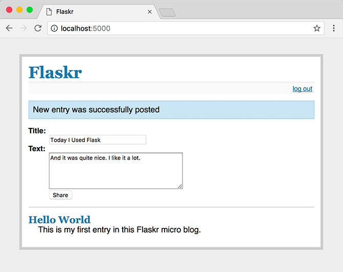

.. _tutorial:

Tutorial
========

You want to develop an application with Python and Flask?  Here you have
the chance to learn that by example.  In this tutorial we will create a
simple microblog application.  It only supports one user that can create
text-only entries and there are no feeds or comments, but it still
features everything you need to get started.  We will use Flask and SQLite
as database which comes out of the box with Python, so there is nothing
else you need.

If you want the full sourcecode in advance or for comparison, check out
the `example source`_.

.. _example source:
   http://github.com/mitsuhiko/flask/tree/master/examples/flaskr/

Introducing Flaskr
------------------

We will call our blogging application flaskr here, feel free to chose a
less web-2.0-ish name ;)  Basically we want it to do the following things:

1. let the user sign in and out with credentials specified in the
   configuration.  Only one user is supported.
2. when the user is logged in he or she can add new entries to the page
   consisting of a text-only title and some HTML for the text.  This HTML
   is not sanitized because we trust the user here.
3. the page shows all entries so far in reverse order (newest on top) and
   the user can add new ones from there if logged in.

We will be using SQlite3 directly for that application because it's good
enough for an application of that size.  For larger applications however
it makes a lot of sense to use `SQLAlchemy`_ that handles database
connections in a more intelligent way, allows you to target different
relational databases at once and more.  You might also want to consider
one of the popular NoSQL databases if your data is more suited for those.

Here a screenshot from the final application:



.. _SQLAlchemy: http://www.sqlalchemy.org/

Step 0: Creating The Folders
----------------------------

Before we get started, let's create the folders needed for this
application::

    /flaskr
        /static
        /templates

The `flaskr` folder is not a python package, but just something where we
drop our files.  Directly into this folder we will then put our database
schema as well as main module in the following steps.  The files inside
the `static` folder are available to users of the application via `HTTP`.
This is the place where css and javascript files go.  Inside the
`templates` folder Flask will look for `Jinja2`_ templates.  Drop all the
templates there.

.. _Jinja2: http://jinja.pocoo.org/2/

Step 1: Database Schema
-----------------------

First we want to create the database schema.  For this application only a
single table is needed and we only want to support SQLite so that is quite
easy.  Just put the following contents into a file named `schema.sql` in
the just created `flaskr` folder:

.. sourcecode:: sql

    drop table if exists entries;
    create table entries (
      id integer primary key autoincrement,
      title string not null,
      text string not null
    );

This schema consists of a single table called `entries` and each row in
this table has an `id`, a `title` and a `text`.  The `id` is an
automatically incrementing integer and a primary key, the other two are
strings that must not be null.

Step 2: Application Setup Code
------------------------------

Now that we have the schema in place we can create the application module.
Let's call it `flaskr.py` inside the `flaskr` folder.  For starters we
will add the imports we will need as well as the config section.  For
small applications it's a possibility to drop the configuration directly
into the module which we will be doing here.  However a cleaner solution
would be to create a separate `.ini` or `.py` file and load that or import
the values from there.

::

    # all the imports
    import sqlite3
    from flask import Flask, request, session, g, redirect, url_for, \
         abort, render_template, flash

    # configuration
    DATABASE = '/tmp/flaskr.db'
    DEBUG = True
    SECRET_KEY = 'development key'
    USERNAME = 'admin'
    PASSWORD = 'default'

Next we can create our actual application and initialize it with the
config::

    # create our little application :)
    app = Flask(__name__)
    app.secret_key = SECRET_KEY
    app.debug = DEBUG

The `secret_key` is needed to keep the client-side sessions secure.
Choose that key wisely and as hard to guess and complex as possible.  The
debug flag enables or disables the interactive debugger.  Never leave
debug mode activated in a production system because it will allow users to
executed code on the server!

We also add a method to easily connect to the database specified.  That
can be used to open a connection on request and also from the interactive
Python shell or a script.  This will come in handy later

::

    def connect_db():
        return sqlite3.connect(DATABASE)

Finally we just add a line to the bottom of the file that fires up the
server if we run that file as standalone application::

    if __name__ == '__main__':
        app.run()

With that out of the way you should be able to start up the application
without problems.  When you head over to the server you will get an 404
page not found error because we don't have any views yet.  But we will
focus on that a little later.  First we should get the database working.

.. admonition:: Troubleshooting

   If you notice later that the browser cannot connect to the server
   during development, you might want to try this line instead::

       app.run(host='127.0.0.1')

   In a nutshell: Werkzeug starts up as IPv6 on many operating systems by
   default and not every browser is happy with that.  This forces IPv4
   usage.

Step 3: Creating The Database
-----------------------------

Flaskr is a database powered application as outlined earlier, and more
precisely, an application powered by a relational database system.  Such
systems need a schema that tells them how to store that information. So
before starting the server for the first time it's important to create
that schema.

Such a schema can be created by piping the `schema.sql` file into the
`sqlite3` command as follows::

    sqlite3 /tmp/flaskr.db < schema.sql

The downside of this is that it requires the sqlite3 command to be
installed which is not necessarily the case on every system.  Also one has
to provide the path to the database there which leaves some place for
errors.  It's a good idea to add a function that initializes the database
for you to the application.

If you want to do that, you first have to import the
:func:`contextlib.closing` function from the contextlib package.  If you
want to use Python 2.5 it's also necessary to enable the `with` statement
first (`__future__` imports must be the very first import)::

    from __future__ import with_statement
    from contextlib import closing

Next we can create a function called `init_db` that initializes the
database.  For this we can use the `connect_db` function we defined
earlier.  Just add that function below the `connect_db` function::
    
    def init_db():
        with closing(connect_db()) as db:
            with app.open_resource('schema.sql') as f:
                db.cursor().executescript(f.read())
            db.commit()

The :func:`~contextlib.closing` helper function allows us to keep a
connection open for the duration of the `with` block.  The
:func:`~flask.Flask.open_resource` method of the application object
supports that functionality out of the box, so it can be used in the
`with` block directly.  This function opens a file from the resource
location (your `flaskr` folder) and allows you to read from it.  We are
using this here to execute a script on the database connection.

When we connect to a database we get a connection object (here called
`db`) that can give us a cursor.  On that cursor there is a method to
execute a complete script.  Finally we only have to commit the changes.
SQLite 3 and other transactional databases will not commit unless you
explicitly tell it to.

Now it is possible to create a database by starting up a Python shell and
importing and calling that function::

>>> from flaskr import init_db
>>> init_db()

Step 4: Request Database Connections
------------------------------------

Now we know how we can open database connections and use them for scripts,
but how can we elegantly do that for requests?  We will need the database
connection in all our functions so it makes sense to initialize them
before each request and shut them down afterwards.

Flask allows us to do that with the :meth:`~flask.Flask.before_request` and
:meth:`~flask.Flask.after_request` decorators::

    @app.before_request
    def before_request():
        g.db = connect_db()

    @app.after_request
    def after_request(response):
        g.db.close()
        return response

Functions marked with :meth:`~flask.Flask.before_request` are called before
a request and passed no arguments, functions marked with
:meth:`~flask.Flask.after_request` are called after a request and
passed the response that will be sent to the client.  They have to return
that response object or a different one.  In this case we just return it
unchanged.

We store our current database connection on the special :data:`~flask.g`
object that flask provides for us.  This object stores information for one
request only and is available from within each function.  Never store such
things on other objects because this would not work with threaded
environments.  That special :data:`~flask.g` object does some magic behind
the scenes to ensure it does the right thing.

Step 5: The View Functions
--------------------------

Now that the database connections are working we can start writing the
view functions.  We will need four of them:

Show Entries
````````````

This view shows all the entries stored in the database.  It listens on the
root of the application and will select title and text from the database.
The one with the highest id (the newest entry) on top.  The rows returned
from the cursor are tuples with the columns ordered like specified in the
select statement.  This is good enough for small applications like here,
but you might want to convert them into a dict.  If you are interested how
to do that, check out the :ref:`easy-querying` example.

The view function will pass the entries as dicts to the
`show_entries.html` template and return the rendered one::

    @app.route('/')
    def show_entries():
        cur = g.db.execute('select title, text from entries order by id desc')
        entries = [dict(title=row[0], text=row[1]) for row in cur.fetchall()]
        return render_template('show_entries.html', entries=entries)

Add New Entry
`````````````

This view lets the user add new entries if he's logged in.  This only
responds to `POST` requests, the actual form is shown on the
`show_entries` page.  If everything worked out well we will
:func:`~flask.flash` an information message to the next request and
redirect back to the `show_entries` page::

    @app.route('/add', methods=['POST'])
    def add_entry():
        if not session.get('logged_in'):
            abort(401)
        g.db.execute('insert into entries (title, text) values (?, ?)',
                     [request.form['title'], request.form['text']])
        g.db.commit()
        flash('New entry was successfully posted')
        return redirect(url_for('show_entries'))

Note that we check that the user is logged in here (the `logged_in` key is
present in the session and `True`).

Login and Logout
````````````````

These functions are used to sign the user in and out.  Login checks the
username and password against the ones from the configuration and sets the
`logged_in` key in the session.  If the user logged in successfully that
key is set to `True` and the user is redirected back to the `show_entries`
page.  In that case also a message is flashed that informs the user he or
she was logged in successfully.  If an error occoured the template is
notified about that and the user asked again::

    @app.route('/login', methods=['GET', 'POST'])
    def login():
        error = None
        if request.method == 'POST':
            if request.form['username'] != USERNAME:
                error = 'Invalid username'
            elif request.form['password'] != PASSWORD:
                error = 'Invalid password'
            else:
                session['logged_in'] = True
                flash('You were logged in')
                return redirect(url_for('show_entries'))
        return render_template('login.html', error=error)

The logout function on the other hand removes that key from the session
again.  We use a neat trick here: if you use the :meth:`~dict.pop` method
of the dict and pass a second parameter to it (the default) the method
will delete the key from the dictionary if present or do nothing when that
key was not in there.  This is helpful because we don't have to check in
that case if the user was logged in.

::

    @app.route('/logout')
    def logout():
        session.pop('logged_in', None)
        flash('You were logged out')
        return redirect(url_for('show_entries'))

Step 6: The Templates
---------------------

Now we should start working on the templates.  If we request the URLs now
we would only get an exception that Flask cannot find the templates.  The
templates are using `Jinja2`_ syntax and have autoescaping enabled by
default.  This means that unless you mark a value in the code with
:class:`~flask.Markup` or with the ``|safe`` filter in the template,
Jinja2 will ensure that special characters such as ``<`` or ``>`` are
escaped with their XML equivalents.

We are also using template inheritance which makes it possible to reuse
the layout of the website in all pages.

Put the following templates into the `templates` folder:

layout.html
```````````

This template contains the HTML skeleton, the header and a link to log in
(or log out if the user was already logged in).  It also displays the
flashed messages if there are any.  The ```` block can be
replaced by a block of the same name (``body``) in a child template.

The :class:`~flask.session` dict is available in the template as well and
you can use that to check if the user is logged in or not.  Note that in
Jinja you can access missing attributes and items of objects / dicts which
makes the following code work, even if there is no ``'logged_in'`` key in
the session:

.. sourcecode:: html+jinja

    <!doctype html>
    <title>Flaskr</title>
    <link rel=stylesheet type=text/css href="{{ url_for('static', filename='style.css') }}">
    <div class=page>
      <h1>Flaskr</h1>
      <div class=metanav>
      
        <a href="{{ url_for('login') }}">log in</a>
      
        <a href="{{ url_for('logout') }}">log out</a>
      
      </div>
      
        <div class=flash>{{ message }}</div>
      
      
    </div>

show_entries.html
`````````````````

This template extends the `layout.html` template from above to display the
messages.  Note that the `for` loop iterates over the messages we passed
in with the :func:`~flask.render_template` function.  We also tell the
form to submit to your `add_entry` function and use `POST` as `HTTP`
method:

.. sourcecode:: html+jinja

    
    
      
        <form action="{{ url_for('add_entry') }}" method=post class=add-entry>
          <dl>
            <dt>Title:
            <dd><input type=text size=30 name=title>
            <dt>Text:
            <dd><textarea name=text rows=5 cols=40></textarea>
            <dd><input type=submit value=Share>
          </dl>
        </form>
      
      <ul class=entries>
      
        <li><h2>{{ entry.title }}</h2>{{ entry.text|safe }}
      
        <li><em>Unbelievable.  No entries here so far</em>
      
      </ul>
    

login.html
``````````

Finally the login template which basically just displays a form to allow
the user to login:

.. sourcecode:: html+jinja

    
    
      <h2>Login</h2>
      <p class=error><strong>Error:</strong> {{ error }}
      <form action="{{ url_for('login') }}" method=post>
        <dl>
          <dt>Username:
          <dd><input type=text name=username>
          <dt>Password:
          <dd><input type=password name=password>
          <dd><input type=submit value=Login>
        </dl>
      </form>
    

Step 7: Adding Style
--------------------

Now that everything else works, it's time to add some style to the
application.  Just create a stylesheet called `style.css` in the `static`
folder we created before:

.. sourcecode:: css

    body            { font-family: sans-serif; background: #eee; }
    a, h1, h2       { color: #377BA8; }
    h1, h2          { font-family: 'Georgia', serif; margin: 0; }
    h1              { border-bottom: 2px solid #eee; }
    h2              { font-size: 1.2em; }
    
    .page           { margin: 2em auto; width: 35em; border: 5px solid #ccc;
                      padding: 0.8em; background: white; }
    .entries        { list-style: none; margin: 0; padding: 0; }
    .entries li     { margin: 0.8em 1.2em; }
    .entries li h2  { margin-left: -1em; }
    .add-entry      { font-size: 0.9em; border-bottom: 1px solid #ccc; }
    .add-entry dl   { font-weight: bold; }
    .metanav        { text-align: right; font-size: 0.8em; padding: 0.3em;
                      margin-bottom: 1em; background: #fafafa; }
    .flash          { background: #CEE5F5; padding: 0.5em;
                      border: 1px solid #AACBE2; }
    .error          { background: #F0D6D6; padding: 0.5em; }

Bonus: Testing the Application
-------------------------------

Now that you have finished the application and everything works as
expected, it's probably not the best idea to add automated tests to
simplify modifications in the future.  The application above is used as a
basic example of how to perform unittesting in the :ref:`testing` section
of the documentation.  Go there to see how easy it is to test Flask
applications.
