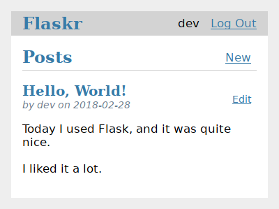
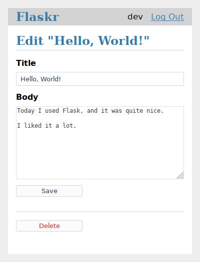

.. _tutorial:

Tutorial
========

.. toctree::
    :caption: Contents:
    :maxdepth: 1

    layout
    factory
    database
    views
    templates
    static
    blog
    install
    tests
    deploy
    next

This tutorial will walk you through creating a basic blog application
called Flaskr. Users will be able to register, log in, create posts,
and edit or delete their own posts. You will be able to package and
install the application on other computers.

It's assumed that you're already familiar with Python. The `official
tutorial`_ in the Python docs is a great way to learn or review first.

.. _official tutorial: https://docs.python.org/3/tutorial/

While it's designed to give a good starting point, the tutorial doesn't
cover all of Flask's features. Check out the :ref:`quickstart` for an
overview of what Flask can do, then dive into the docs to find out more.
The tutorial only uses what's provided by Flask and Python. In another
project, you might decide to use :ref:`extensions` or other libraries to
make some tasks simpler.

.. image:: flaskr_login.png
    :align: center
    :class: screenshot
    :alt: screenshot of login page

Flask is flexible. It doesn't require you to use any particular project
or code layout. However, when first starting, it's helpful to use a more
structured approach. This means that the tutorial will require a bit of
boilerplate up front, but it's done to avoid many common pitfalls that
new developers encounter, and it creates a project that's easy to expand
on. Once you become more comfortable with Flask, you can step out of
this structure and take full advantage of Flask's flexibility.

:gh:`The tutorial project is available as an example in the Flask
repository <examples/tutorial>`, if you want to compare your project
with the final product as you follow the tutorial.

Continue to :doc:`layout`.
